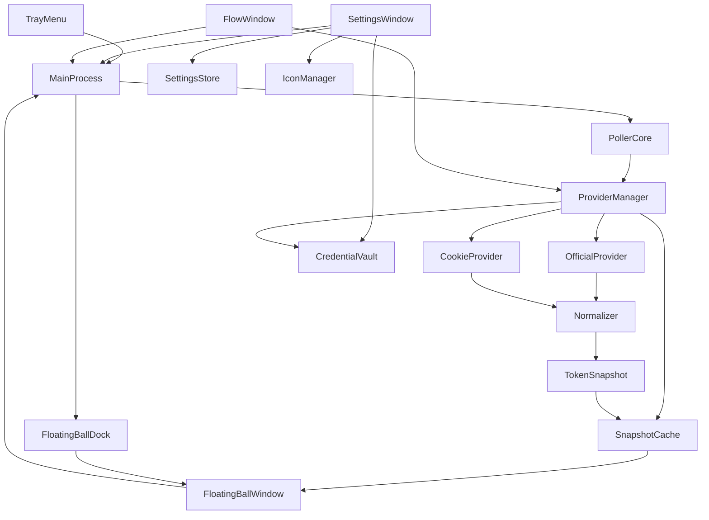

# Cursor Token Monitor — 项目参考文档

> Windows 桌面悬浮球，定期显示 Cursor 账号 **First-party models / API** 用量与余量。  
> 本文档整合需求说明、架构设计、实现细节、使用与维护指南，便于后续查阅。

---

## 目录

1. [项目概述](#1-项目概述)
2. [快速开始](#2-快速开始)
3. [功能需求](#3-功能需求)
4. [架构设计](#4-架构设计)
5. [目录结构](#5-目录结构)
6. [数据模型与接口映射](#6-数据模型与接口映射)
7. [轮询与故障切换](#7-轮询与故障切换)
8. [安全设计](#8-安全设计)
9. [界面与交互](#9-界面与交互)
10. [配置项说明](#10-配置项说明)
11. [打包与发布](#11-打包与发布)
12. [验收清单](#12-验收清单)
13. [维护与扩展](#13-维护与扩展)
14. [风险与版本规划](#14-风险与版本规划)

---

## 1. 项目概述

| 项 | 说明 |
|---|---|
| 项目名称 | Cursor Token Monitor（Cursor Token 悬浮球） |
| 平台 | Windows |
| 技术栈 | Electron + TypeScript + React + Vite |
| 版本 | v1.0.0 |
| 目标用户 | 个人开发者（账号所有者本人） |

### 背景与目标

- **背景**：需要在桌面实时查看 Cursor 账号 token 余量，避免频繁打开网页或控制台。
- **目标**：提供轻量、常驻、可配置自动刷新的悬浮球，展示 First-party models 与 API 用量概览、周期明细及余量。
- **数据策略**：官方接口优先（`OfficialProvider`），连续失败后自动回退到 Dashboard Cookie 接口（`CookieProvider`）。Cookie 方案优先读取 `usage-summary` 汇总数据；`get-aggregated-usage-events` 用于 Included Usage 周期模型明细；`get-filtered-usage-events` 作为今日/周期 token 与回退补充，避免明细接口不稳定时影响主数据展示。

### 范围

**范围内：**
- Windows 悬浮球（拖拽、置顶、贴边半隐收起、托盘）
- First-party models / API 余量与 Dashboard 用量指标展示（概览 / 用量切换）
- 用量流水独立窗口（日期筛选、分页、手动刷新；字段对齐 cursor.com 控制台）
- 系统托盘悬停展示概览用量摘要；右键打开流水 / 设置 / 退出
- 自动刷新与间隔配置
- 双 Provider 故障切换
- Dashboard API 多端点候选与局部降级
- Cookie 手动配置与连通性测试
- 快照本地缓存（启动/失败时展示 stale 数据）
- 自定义应用图标（托盘/设置窗即时生效）

**范围外：**
- 跨平台（macOS / Linux）
- 多账号切换（首版单账号）
- 服务端中转

### 术语

| 术语 | 含义 |
|---|---|
| auto | Cursor First-party models 池（原 Auto + Composer，含 Auto、Composer、Grok 等自有模型） |
| api | Cursor API 调用相关 token |
| Provider | 数据获取单元（Official / Cookie） |
| TokenSnapshot | 统一后的展示数据结构 |

---

## 2. 快速开始

### 环境要求

- Node.js >= 16（推荐 18+）
- Windows 10/11

### 安装与运行

```bash
# 安装依赖
npm install

# 开发模式（热更新 + Electron）
npm run dev

# 生产构建（Vite 编译渲染层与 Electron 主/预加载进程）
npm run build
npm start

# 类型检查（tsc --noEmit，不生成 dist-electron 冗余产物）
npm run typecheck

# 打包安装程序（typecheck + build + electron-builder）
npm run dist
```

### 首次使用

1. 启动应用，屏幕右下角出现悬浮球
2. 右键系统托盘 → **设置** 或 **流水**
3. 在浏览器 DevTools 中复制 `WorkosCursorSessionToken` 的值，或复制包含该字段的完整 `cursor.com` Cookie，粘贴并保存
4. 点击 **测试连接** 验证
5. 悬浮球按设定间隔自动刷新，展示 First-party models / API 余量及数据来源

### 获取 Cookie 方法

1. 浏览器登录 [cursor.com](https://www.cursor.com)
2. 打开开发者工具（F12）→ Network
3. 刷新页面，任选 cursor.com 请求
4. 优先复制 `WorkosCursorSessionToken` 的值；也可以复制 Request Headers 中的 `Cookie` 完整值
5. 粘贴到设置页并保存（存储在 Windows 凭据库，非明文文件）

---

## 3. 功能需求

### FR-01 悬浮球显示

- 启动后显示悬浮球，支持拖拽与置顶
- 折叠态：总余量百分比（「余量」）+ 健康状态点 + 圆环进度
- 展开态：默认「概览」视图；有 Included Usage 数据时可切换至「用量」视图
- 贴边收起：AssistiveTouch 风格半隐圆球（闲置约半隐 + 半透明；悬停滑入变实）

### FR-02 明细展示

**概览视图：**

- 顶部 dashboard：总消耗百分比、进度条、周期 token 汇总、状态 pill、来源、上次刷新时间
- 四张 metric 卡片纵向排列：今日 API、今日 First-party models、周期 API、周期 First-party models（百分比 + token 明细）
- 退避 / 暂停 / 无数据等状态提示

**用量视图（有 Included Usage 数据时可用）：**

- 按模型聚合的 Included Usage 列表（API / First-party 分区，账单周期、tokens、占比）
- 列表区域独立滚动，概览视图无纵向滚动条

**通用：**

- `auto.remaining` / `auto.limit`、`api.remaining` / `api.limit`（接口提供时用于余量计算）
- 数据来源（official / cookie）
- stale 时状态 pill 显示「缓存数据」（不另设整页缓存提示条）

### FR-03 自动刷新与间隔配置

- 默认开启，默认间隔 **30 秒**
- 可配置范围：**30 – 3600 秒**
- 非法输入拦截并提示，修改后立即生效并持久化；历史配置若低于 30 秒，启动时自动钳制
- 支持暂停 / 恢复；暂停期间可手动刷新
- 刷新中：悬浮球与概览面板有加载反馈（旋转刷新按钮、双电流边框等）

### FR-04 数据源策略与容错

- 优先 `OfficialProvider`
- 连续失败 **3 次**（可配置）后切换 `CookieProvider`
- 回退后每 **120 秒** 探测官方接口是否恢复，恢复则自动切回
- UI 显示当前来源标签

### FR-05 Cookie 配置与测试

- 手动粘贴 Cookie
- 测试连接：成功 / 失败 + 原因；成功时展示结构化详情（耗时、数据源、总消耗、账单周期、Token 配额、用量分项、Included Usage 状态等）
- 一键清除凭据

### FR-06 托盘与生命周期

- 托盘菜单：流水、设置、退出（不再提供立即刷新 / 暂停恢复；刷新与暂停仍可通过悬浮球与设置页操作）
- 悬停托盘图标：多行概览用量摘要（总消耗、今日/周期 API 与 FP 分项、来源与更新时间；随快照刷新更新，无快照时显示「暂无数据」）
- 关闭悬浮窗后驻留托盘，不强制退出

### FR-07 贴边缘自动收起

- 拖拽悬浮球贴近屏幕边缘松手后自动收起为半隐圆球（四边对称）
- 悬停滑入变实；点击展开或向外拖出可恢复完整显示
- 设置项 `edgeAutoDockEnabled`（默认开启）可开关

### FR-08 自定义应用图标

- 设置页可选择本地图片作为应用图标
- 托盘与设置窗口即时生效
- 支持恢复默认图标；安装包/任务栏图标需重新打包后更新

### FR-09 快照本地缓存

- 成功刷新后将 `TokenSnapshot` 持久化到 `%APPDATA%/cursor-token-monitor/snapshot-cache.json`
- 启动时或请求失败时展示缓存数据，标记 `stale = true` 并提示用户

### FR-10 用量流水窗口

- 托盘「流水」或相关入口打开独立窗口，**不依赖** poller 快照自动刷新
- 通过 `fetch-usage-flow` IPC 手动拉取（打开窗口 / 刷新 / 切换筛选或分页时请求）
- 日期快捷筛选：1d / 7d / 30d / MTD / Last month，以及自定义日期范围（按东八区日历日）
- 服务端分页：默认每页 100 条，上一页 / 下一页
- 列表五列对齐控制台：Date (UTC+8)、Type、Model、Tokens、Cost
- 字段映射：`default`→`auto`；`maxMode` 显示蓝色 MAX 徽标；Included / Free / Usage-based 等 Type/Cost 与控制台一致；无 token 显示 `-`
- 无 Cookie 时提示需配置凭据；数据来自 `get-filtered-usage-events`（与控制台同源）

### 非功能需求

| 类别 | 要求 |
|---|---|
| 性能 | 冷启动 5 秒内显示悬浮球；单次请求超时默认 10 秒 |
| 稳定性 | 接口失败不崩溃；指数退避重试 |
| 安全 | Cookie 不明文存储；日志脱敏 |
| 可维护性 | Provider 与 UI 解耦；关键行为可追踪日志 |

---

## 4. 架构设计



### 模块职责

| 模块 | 文件 | 职责 |
|---|---|---|
| 主进程 | `electron/main.ts` | 生命周期、IPC、协调各模块 |
| 边缘吸附 | `electron/floatingBallDock.ts` | 贴边半隐、悬停滑入、窗口 undock |
| 图标管理 | `electron/iconManager.ts` | 自定义图标读写与预览 |
| 悬浮窗 | `electron/windows/floatingBall.ts` | 无边框置顶窗口 |
| 设置窗 | `electron/windows/settings.ts` | 配置界面 |
| 流水窗 | `electron/windows/flow.ts` | 用量流水独立窗口 |
| 托盘 | `electron/tray.ts` | 系统托盘菜单与悬停 tooltip |
| 预加载 | `electron/preload.ts` | 安全 IPC 桥接 |
| 轮询器 | `src/core/poller.ts` | 定时刷新、退避、状态机 |
| 快照缓存 | `src/core/SnapshotCache.ts` | 本地快照持久化与加载 |
| Provider 管理 | `src/core/providers/ProviderManager.ts` | 优先级切换、故障转移、流水拉取 |
| 官方数据源 | `src/core/providers/OfficialProvider.ts` | 无 Cookie 请求 |
| Cookie 数据源 | `src/core/providers/CookieProvider.ts` | 带 Cookie 请求（含流水分页） |
| 标准化 | `src/core/normalizer.ts` | 统一字段映射、流水页构建 |
| 设置存储 | `src/settings/SettingsStore.ts` | JSON 持久化 |
| 凭据库 | `src/security/CredentialVault.ts` | keytar / safeStorage |
| 日志 | `src/utils/logger.ts` | 敏感信息脱敏 |
| 格式化 | `src/shared/format.ts` | 展示格式化、托盘 tooltip、概览/用量构建 |
| 流水格式化 | `src/shared/usageFlowFormat.ts` | Type/Model/Tokens/Cost 对齐控制台 |
| 流水日期 | `src/shared/usageFlowDates.ts` | 东八区日期预设与自定义范围 |
| 悬浮球 UI | `src/renderer/App.tsx` | 折叠/展开、概览/用量切换 |
| 设置 UI | `src/renderer/pages/SettingsPage.tsx` | 凭据优先、刷新、外观 |
| 流水 UI | `src/renderer/pages/FlowPage.tsx` | 筛选、分页、手动刷新 |
| 连接测试面板 | `src/renderer/components/TestConnectionResultPanel.tsx` | 测试连接结构化结果 |
| 指标行 | `src/renderer/components/MetricRow.tsx` | Dashboard metric 明细展示 |
| Included 列表 | `src/renderer/components/IncludedUsageTable.tsx` | Included Usage 用量明细 |
| 流水表格 | `src/renderer/components/UsageFlowTable.tsx` | 用量流水五列展示 |

---

## 5. 目录结构

```
cursor_monitor/
├── electron/                    # Electron 主进程
│   ├── main.ts                  # 入口、IPC 注册
│   ├── preload.ts               # 渲染进程 API 桥接
│   ├── tray.ts                  # 系统托盘
│   ├── floatingBallDock.ts      # 边缘吸附与半隐
│   ├── iconManager.ts           # 自定义图标管理
│   └── windows/
│       ├── floatingBall.ts      # 悬浮球窗口
│       ├── settings.ts          # 设置窗口
│       └── flow.ts              # 用量流水窗口
├── src/
│   ├── core/
│   │   ├── poller.ts            # 轮询与状态机
│   │   ├── SnapshotCache.ts     # 快照本地缓存
│   │   ├── normalizer.ts        # 字段标准化 / 流水页构建
│   │   └── providers/
│   │       ├── OfficialProvider.ts
│   │       ├── CookieProvider.ts
│   │       └── ProviderManager.ts
│   ├── settings/
│   │   └── SettingsStore.ts     # 本地配置
│   ├── security/
│   │   └── CredentialVault.ts   # 凭据安全存储
│   ├── shared/
│   │   ├── types.ts             # 类型定义
│   │   ├── format.ts            # 展示格式化
│   │   ├── usageFlowDates.ts    # 流水日期范围
│   │   └── usageFlowFormat.ts   # 流水字段映射
│   ├── utils/
│   │   └── logger.ts            # 脱敏日志
│   └── renderer/                # React 渲染层
│       ├── App.tsx              # 悬浮球
│       ├── flow-main.tsx        # 流水窗入口
│       ├── pages/
│       │   ├── SettingsPage.tsx
│       │   └── FlowPage.tsx
│       └── components/
│           ├── TokenBadge.tsx
│           ├── MetricRow.tsx
│           ├── IncludedUsageTable.tsx
│           ├── IncludedUsageModelName.tsx
│           ├── UsageFlowTable.tsx
│           ├── UsageFlowFilters.tsx
│           ├── UsageFlowPagination.tsx
│           ├── TestConnectionResultPanel.tsx
│           └── ErrorHint.tsx
├── docs/
│   └── changes/                 # 代码变更归档（见 .cursor/rules/change-archive.mdc）
├── index.html                   # 悬浮球入口
├── settings.html                # 设置页入口
├── flow.html                    # 用量流水入口
├── vite.config.ts
├── tsconfig.json
├── tsconfig.electron.json
├── electron-builder.yml
├── package.json
├── requirements.md              # 原始需求说明书（已合并至本文档）
└── release/                     # 打包产物
```

---

## 6. 数据模型与接口映射

### TokenSnapshot（统一输出）

```json
{
  "source": "official",
  "auto": { "remaining": 120000, "limit": 200000, "resetAt": "2026-07-31T00:00:00Z" },
  "api": { "remaining": 80000, "limit": 100000, "resetAt": "2026-07-31T00:00:00Z" },
  "fetchedAt": "2026-07-03T04:00:00Z",
  "stale": false,
  "rawVersion": "official:v1"
}
```

| 字段 | 类型 | 说明 |
|---|---|---|
| source | `official \| cookie` | 数据来源 |
| auto / api | `{ remaining, limit, resetAt? }` | 余量信息，缺失为 null |
| metrics | `UsageMetrics` | dashboard 百分比、周期 token、今日 token/消耗等补充指标 |
| fetchedAt | ISO 8601 | 抓取时间 |
| stale | boolean | 是否过期/不完整 |
| rawVersion | string | 接口版本标识，便于排障 |

### OfficialProvider 映射

默认端点：`https://www.cursor.com/api/usage`

```json
{
  "autoRemaining": 120000,
  "autoLimit": 200000,
  "autoResetAt": "2026-07-31T00:00:00Z",
  "apiRemaining": 80000,
  "apiLimit": 100000,
  "apiResetAt": "2026-07-31T00:00:00Z"
}
```

| 原始字段 | TokenSnapshot 字段 |
|---|---|
| autoRemaining | auto.remaining |
| autoLimit | auto.limit |
| autoResetAt | auto.resetAt |
| apiRemaining | api.remaining |
| apiLimit | api.limit |
| apiResetAt | api.resetAt |

`normalizer.ts` 同时支持嵌套格式（`auto.remaining`、`usage.auto.remaining` 等）。

### CookieProvider 映射（Dashboard 替代方案）

默认候选端点（请求头带 Cookie）：

1. `https://cursor.com/api/usage-summary`
2. `https://www.cursor.com/api/usage-summary`
3. `https://cursor.com/api/dashboard/usage-summary`
4. `https://www.cursor.com/api/dashboard/usage-summary`
5. 用户配置的 `cookieEndpoint`

这些端点返回 dashboard 汇总用量，是当前更稳定的主数据来源。实现上每个候选端点独立超时，当前一个端点超时、404、5xx 或返回不可用内容时，会继续尝试下一个候选端点。

```json
{
  "billingCycleStart": "2026-07-01T00:00:00Z",
  "billingCycleEnd": "2026-07-31T00:00:00Z",
  "individualUsage": {
    "plan": {
      "limit": 20,
      "remaining": 12,
      "totalPercentUsed": 40,
      "apiPercentUsed": 10,
      "autoPercentUsed": 30
    }
  }
}
```

| 原始字段 | TokenSnapshot 字段 |
|---|---|
| individualUsage.plan.autoPercentUsed + limit | auto.remaining / auto.limit / metrics.autoUsedPercent |
| individualUsage.plan.apiPercentUsed + limit | api.remaining / api.limit / metrics.apiUsedPercent |
| individualUsage.plan.totalPercentUsed | metrics.totalUsedPercent |
| billingCycleEnd | auto.resetAt / api.resetAt |

### Usage Events 明细补充

补充端点：

1. `https://cursor.com/api/dashboard/get-aggregated-usage-events`（Billing Included Usage 同源聚合，优先）
2. `https://www.cursor.com/api/dashboard/get-aggregated-usage-events`
3. `https://cursor.com/api/dashboard/get-filtered-usage-events`（今日/周期 token 与 Included Usage 回退）
4. `https://www.cursor.com/api/dashboard/get-filtered-usage-events`

`get-aggregated-usage-events` 返回周期内按模型汇总的 tokens / cost，用于展开面板底部 **Included Usage**，与控制台 Billing 口径对齐，无需事件分页。

`get-filtered-usage-events` 用于补充周期内 token 总量和今日 token/消耗，并在聚合接口不可用时回退构建 Included Usage。该端点依赖 `WorkosCursorSessionToken` 中的 `userId`，应用会从 `userId::jwt`、URL 编码格式或 JWT `sub` 中提取。若事件接口失败、超时或无法提取 `userId`，应用仍会展示 `usage-summary` 的汇总百分比，并将 token 明细保持为 `null`。

用量流水窗口通过同一 `get-filtered-usage-events` 端点**独立分页拉取**（不写入 `TokenSnapshot`，避免快照缓存膨胀）。展示映射见 `src/shared/usageFlowFormat.ts`：

| 控制台列 | 规则 |
|---|---|
| Date | `timestamp` 毫秒字符串先转 number，格式化为东八区 |
| Type | 显式 `kind` 优先（Included / Free / Usage-based 等）；无 token 且非 Usage-based 时默认 Free |
| Model | `default` → `auto`；`maxMode: true` 时附加蓝色 MAX 徽标 |
| Tokens | 有用量用「万」等格式；零/空显示 `-` |
| Cost | Included / Free 显示文案本身；Usage-based 等显示金额 |

### 异常处理规则

- 单字段缺失 → 该字段为 `null`，不影响其他字段
- 两类余量均缺失 → `stale = true`，提示「数据不完整」
- 事件明细失败 → 保留汇总数据，仅缺失 token 明细
- 汇总解析失败 → 保留最近成功快照，进入退避重试
- 日志禁止输出完整 Cookie / Authorization

---

## 7. 轮询与故障切换

### 自动刷新状态机

| 状态 | 说明 |
|---|---|
| idle | 初始 |
| running | 正常轮询 |
| backoff | 失败退避等待 |
| paused | 用户暂停 |

| 事件 | 行为 |
|---|---|
| start | → running |
| refreshSuccess | 保持 running，重置失败计数 |
| refreshFail | 失败 +1，必要时 → backoff |
| pause | → paused |
| resume | paused → running |
| manualRefresh | 任意状态触发一次，paused 不改变暂停状态 |

### 退避策略

失败时：`30s → 60s → 120s → 300s`（上限 5 分钟）  
成功后：恢复为用户设置的刷新间隔

### Provider 切换流程

```
OfficialProvider 请求
    │
    ├─ 成功 → 展示数据，source = official
    │
    └─ 连续失败 ≥ failureThreshold（默认 3 次）
           │
           ├─ Cookie 已配置 → 切换 CookieProvider
           │                    ├─ usage-summary 成功 → 展示汇总数据
           │                    ├─ usage events 成功 → 补充 token 明细
           │                    ├─ usage events 失败 → 仅展示汇总数据
           │                    └─ 每 120s 探测 Official 是否恢复
           │
           └─ Cookie 未配置 → 保留上次快照，stale = true，提示配置 Cookie
```

---

## 8. 安全设计

| 措施 | 实现 |
|---|---|
| Cookie 存储 | Windows Credential Manager（keytar），失败时 safeStorage 加密本地文件 |
| 配置文件 | 仅存非敏感项（刷新间隔、端点 URL），不含 Cookie |
| 日志脱敏 | `logger.ts` 对 cookie / authorization / session 等字段打码 |
| 用户提示 | 设置页说明 Cookie 仅用于本人账号查看 |
| 清除凭据 | 一键删除，之后不再发起 Cookie 请求 |

---

## 9. 界面与交互

### 悬浮球

| 状态 | 内容 |
|---|---|
| 折叠 | 圆形球体、余量百分比、圆环进度、健康点（绿/黄/蓝/灰） |
| 贴边收起 | 半隐圆球（闲置约半隐 + opacity 0.4；悬停滑入变实），点击展开或拖出恢复 |
| 展开 · 概览 | 总消耗 dashboard、4 张纵向 metric 卡片、状态/来源/时间、刷新/设置/收起；面板进出场动画 |
| 展开 · 用量 | Included Usage 分区列表（有数据时底部分段「概览 / 用量」），长模型名自动换行 |

健康点含义：
- **绿**：数据正常
- **黄**：数据过期或退避中（stale 时 pill 显示「缓存数据」）
- **蓝**：自动刷新已暂停，或正在刷新
- **灰**：暂无数据

未贴边窗口固定 **300×548**，展开/收起与概览/用量切换不再改变窗体尺寸；贴边 peek 高度为 **448**（宽度同 300）。

### 设置页

分区顺序（上 → 下）：

1. **凭据与连接**：Cookie 输入 / 保存 / 清除、测试连接（结构化详情）
2. **数据刷新**：自动刷新开关与间隔（秒，30–3600），修改即时保存
3. **贴边**：`edgeAutoDockEnabled` 开关
4. **外观**：自定义应用图标（选择 / 恢复默认）

### 用量流水窗

- 日期快捷：1d / 7d / 30d / MTD / Last month + 自定义范围
- 手动刷新按钮；切换筛选或分页时重新拉取
- 表格：Date (UTC+8)、Type、Model（含 MAX）、Tokens、Cost
- 底部分页：每页 100 条，显示总条数与页码
- 无 Cookie / 拉取失败时给出可操作提示

### 托盘

**悬停提示**（多行，随快照更新）：

```text
总消耗 12.34%
今日 API 1.20% · 今日 FP 2.30%
周期 API 10.00% · 周期 FP 5.00%
官方 · 14:32:05
```

**右键菜单**

- 流水
- 设置
- 退出

---

## 10. 配置项说明

配置文件位置：`%APPDATA%/cursor-token-monitor/settings.json`

| 配置项 | 默认值 | 说明 |
|---|---|---|
| autoRefreshEnabled | true | 是否自动刷新 |
| refreshIntervalSec | 30 | 刷新间隔（**30**–3600） |
| requestTimeoutSec | 10 | 单次请求超时 |
| officialEndpoint | `https://www.cursor.com/api/usage` | 官方接口 |
| cookieEndpoint | `https://cursor.com/api/usage-summary` | 用户自定义 Cookie 汇总接口候选 |
| failureThreshold | 3 | 切换 Provider 的失败次数阈值 |
| edgeAutoDockEnabled | true | 贴边缘自动收起 |
| customIconPath | null | 自定义图标路径（null 为默认） |

修改端点或映射逻辑见 [维护与扩展](#13-维护与扩展)。

---

## 11. 打包与发布

### 前置步骤：生成图标

项目使用 `build/icon.png` 作为图标源文件。打包前必须将其转换为多尺寸 `.ico` 文件（NSIS 安装包需要）：

```powershell
powershell -ExecutionPolicy Bypass -File scripts\create-icon.ps1
```

脚本会从 `build/icon.png` 居中裁剪为正方形，生成 16/32/48/256 四种尺寸的 `build/icon.ico`。

> **注意**：每次更换 `build/icon.png` 后都需要重新执行此脚本，否则 NSIS 构建会因无法读取图标而失败。

### 执行打包

```bash
npm run dist
```

等价于 `npm run typecheck && npm run build && electron-builder`：

1. **typecheck** — `tsc --noEmit` 类型检查，不生成冗余 JS
2. **build** — Vite 编译 `dist/`（渲染层）与 `dist-electron/main.js`、`preload.js`（主/预加载进程）
3. **electron-builder** — 打包 NSIS 安装包与 portable 便携版

产物位于 `release/`：

| 文件 | 说明 |
|---|---|
| `Cursor Token Monitor Setup 1.0.0.exe` | NSIS 安装包 |
| `Cursor Token Monitor 1.0.0.exe` | 便携版 |
| `win-unpacked/` | 免安装目录 |

> 当前环境打包时禁用了代码签名（`signAndEditExecutable: false`）。正式发布建议配置证书签名。

### 体积优化策略

| 优化项 | 配置 | 效果 |
|---|---|---|
| 收窄打包输入 | `files` 仅含 `dist-electron/main.js`、`preload.js`，排除 `*.map` | 避免 tsc 重复产物进入 asar |
| 依赖归类 | `react`/`react-dom` 置于 devDependencies | 避免重复打入 asar |
| Locale 裁剪 | `electronLanguages: [en-US, zh-CN]` | locales 从 ~36 MB 降至 ~1 MB |
| 压缩级别 | `compression: maximum` | NSIS 安装包进一步压缩 |

当前典型体积（x64）：便携版 ~67 MB，安装包 ~67 MB（较初始 ~74 MB 减少约 7 MB）。

### 打包前注意事项

**打包前必须关闭已运行的应用**，否则 `electron-builder` 会因无法删除正在使用的 `Cursor Token Monitor.exe` 而失败，报错 `Access is denied`。

可通过以下命令强制关闭：

```powershell
Get-Process -Name "Cursor Token Monitor" -ErrorAction SilentlyContinue | Stop-Process -Force
```

---

## 12. 验收清单

- [ ] 启动后 5 秒内出现悬浮球，可拖拽、置顶、贴边半隐收起
- [ ] 折叠态显示余量百分比；展开概览可见总消耗与 4 张纵向 metric 卡片
- [ ] 有 Included Usage 时可在概览/用量间切换，概览无纵向滚动
- [ ] 稳定展示 First-party models / API 数值与 Dashboard 指标，标注数据来源
- [ ] 自动刷新默认开启，间隔可改（30–3600 秒）且立即生效
- [ ] 非法间隔输入被拦截，轮询不崩溃
- [ ] 官方接口失败后自动回退 Cookie，界面有提示
- [ ] 清除凭据后停止敏感请求，UI 给出引导
- [ ] 快照缓存在启动/失败时可展示 stale 数据（状态 pill 标识）
- [ ] 托盘悬停显示多行概览用量，随刷新更新
- [ ] 托盘右键仅含流水、设置、退出
- [ ] 流水窗可按日期筛选与分页手动刷新，五列与控制台一致
- [ ] 设置页连接测试展示结构化详情；凭据区位于最上方
- [ ] 自定义图标可即时生效于托盘与设置窗
- [ ] 安装包可在 Windows 环境安装运行

---

## 13. 维护与扩展

### 接口变更时改哪里

Cursor 接口字段或路径变化时，通常只需改以下文件，**无需动 UI**：

1. **`src/core/providers/OfficialProvider.ts`** — 官方请求 URL、Header
2. **`src/core/providers/CookieProvider.ts`** — Cookie 请求 URL、Header（含流水分页）
3. **`src/core/normalizer.ts`** — 字段映射规则、流水页构建
4. **`src/shared/usageFlowFormat.ts`** — 流水 Type/Model/Tokens/Cost 展示映射
5. **`src/shared/types.ts`** — 如有新原始响应结构，补充类型

### 新增 Provider

1. 在 `src/core/providers/` 新建 Provider 类，实现 `TokenProvider` 接口
2. 在 `ProviderManager.ts` 注册优先级与切换逻辑
3. 在 `normalizer.ts` 添加对应 normalize 函数

### IPC 接口一览

| 通道 | 方向 | 说明 |
|---|---|---|
| get-snapshot | invoke | 获取当前 TokenSnapshot |
| get-poller-state | invoke | 获取轮询状态 |
| get-settings | invoke | 获取配置 |
| update-settings | invoke | 更新配置 |
| save-cookie | invoke | 保存 Cookie |
| clear-cookie | invoke | 清除凭据 |
| has-cookie | invoke | 是否已配置 Cookie |
| test-connection | invoke | 测试 Cookie 连接 |
| manual-refresh | invoke | 手动刷新 |
| toggle-pause | invoke | 暂停/恢复 |
| get-icon-preview | invoke | 获取图标预览 Data URL |
| select-custom-icon | invoke | 选择自定义图标 |
| clear-custom-icon | invoke | 恢复默认图标 |
| snapshot-updated | event | 快照更新推送 |
| poller-state | event | 轮询状态推送 |
| settings-changed | event | 配置变更推送 |
| dock-state-changed | event | 贴边状态变更（edge 或 null） |
| open-settings | send | 打开设置窗口 |
| open-flow | send | 打开用量流水窗口 |
| fetch-usage-flow | invoke | 按日期范围与页码拉取用量流水（独立手动刷新） |
| set-orb-mode | send | 设置悬浮球窗口模式（collapsed/hover/expanded） |
| set-expanded | send | 设置展开状态 |
| move-window | send | 拖拽移动窗口 |
| finish-window-move | send | 拖拽结束，触发贴边检测 |
| undock-window | send | 从贴边状态恢复 |

### 常见问题

| 问题 | 排查 |
|---|---|
| 悬浮球无数据 | 检查 Cookie 是否过期；设置页测试连接 |
| 一直显示 cookie 来源 | 官方接口不可用，属正常回退；确认端点 URL |
| 数据不完整 | `usage-summary` 字段变化，更新 normalizer 映射 |
| 有百分比但无 token 明细 | `get-filtered-usage-events` 失败或 Cookie 中无法解析 userId；主汇总数据不受影响 |
| 流水窗无数据 / Date 为空 | 确认 Cookie；检查 `timestamp` 是否为毫秒数字；对照 `usageFlowFormat.ts` |
| 流水 Type/Cost 与控制台不一致 | 更新 `resolveUsageFlowType` / `resolveUsageFlowCost`；零 token 默认 Free |
| keytar 安装失败 | 使用 safeStorage 回退；或安装 Windows Build Tools |
| 打包时报 `Access is denied` | 已打包的应用正在运行，关闭后重试（托盘 → 退出，或用 `Stop-Process` 强制关闭） |
| 打包时报 `unable to read icon from file` | `build/icon.ico` 无效或缺失，执行 `scripts/create-icon.ps1` 重新生成 |

---

## 14. 风险与版本规划

### 风险

- 官方 `/api/usage` 不可用或频繁变更 → OfficialProvider 不稳定
- Dashboard 事件明细接口可能限流或字段变化 → token 明细缺失，但汇总百分比仍可展示
- Cookie 获取方式可能随平台策略调整
- 接口无公开文档，字段映射需持续维护

### 假设

- 用户可合法获取并维护本人 Cookie
- 首版不做历史统计图表

### 版本规划

| 版本 | 内容 |
|---|---|
| **v1（当前）** | 单账号、自动刷新、双 Provider 回退、Dashboard 概览/用量、用量流水窗、贴边半隐、托盘悬停用量、自定义图标、快照缓存、连接测试详情 |
| v1.1 | 开机自启、主题适配、简易历史趋势 |
| v1.2 | 多账号、告警阈值通知 |

---

*文档版本：v1.3 | 最后更新：2026-07-22*
