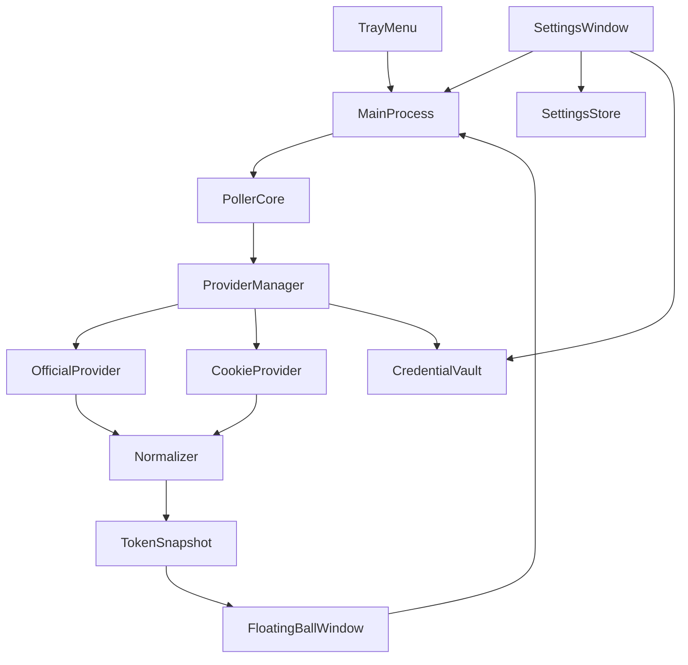

# Cursor Token Monitor — 项目参考文档

> Windows 桌面悬浮球，实时显示 Cursor 账号 **Auto / API** token 余量。  
> 本文档整合需求说明、架构设计、实现细节、使用与维护指南，便于后续查阅。

---

## 目录

1. [项目概述](#1-项目概述)
2. [快速开始](#2-快速开始)
3. [功能需求](#3-功能需求)
4. [架构设计](#4-架构设计)
5. [目录结构](#5-目录结构)
6. [数据模型与接口映射](#6-数据模型与接口映射)
7. [轮询与故障切换](#7-轮询与故障切换)
8. [安全设计](#8-安全设计)
9. [界面与交互](#9-界面与交互)
10. [配置项说明](#10-配置项说明)
11. [打包与发布](#11-打包与发布)
12. [验收清单](#12-验收清单)
13. [维护与扩展](#13-维护与扩展)
14. [风险与版本规划](#14-风险与版本规划)

---

## 1. 项目概述

| 项 | 说明 |
|---|---|
| 项目名称 | Cursor Token Monitor（Cursor Token 悬浮球） |
| 平台 | Windows |
| 技术栈 | Electron + TypeScript + React + Vite |
| 版本 | v1.0.0 |
| 目标用户 | 个人开发者（账号所有者本人） |

### 背景与目标

- **背景**：需要在桌面实时查看 Cursor 账号 token 余量，避免频繁打开网页或控制台。
- **目标**：提供轻量、常驻、可配置自动刷新的悬浮球，展示 `auto` 与 `api` 两类余量。
- **数据策略**：官方接口优先（`OfficialProvider`），连续失败后自动回退到 Dashboard Cookie 接口（`CookieProvider`）。Cookie 方案优先读取 `usage-summary` 汇总数据，`get-filtered-usage-events` 仅作为 token 明细补充，避免明细接口不稳定时影响主数据展示。

### 范围

**范围内：**
- Windows 悬浮球（拖拽、置顶、托盘）
- Auto / API 余量展示
- 自动刷新与间隔配置
- 双 Provider 故障切换
- Dashboard API 多端点候选与局部降级
- Cookie 手动配置与连通性测试

**范围外：**
- 跨平台（macOS / Linux）
- 多账号切换（首版单账号）
- 服务端中转

### 术语

| 术语 | 含义 |
|---|---|
| auto | Cursor 自动额度 / 自动计费相关 token |
| api | Cursor API 调用相关 token |
| Provider | 数据获取单元（Official / Cookie） |
| TokenSnapshot | 统一后的展示数据结构 |

---

## 2. 快速开始

### 环境要求

- Node.js >= 16（推荐 18+）
- Windows 10/11

### 安装与运行

```bash
# 安装依赖
npm install

# 开发模式（热更新 + Electron）
npm run dev

# 生产构建
npm run build
npm start

# 类型检查
npm run typecheck

# 打包安装程序
npm run dist
```

### 首次使用

1. 启动应用，屏幕右下角出现悬浮球
2. 右键系统托盘 → **打开设置**
3. 在浏览器 DevTools 中复制 `WorkosCursorSessionToken` 的值，或复制包含该字段的完整 `cursor.com` Cookie，粘贴并保存
4. 点击 **测试连接** 验证
5. 悬浮球按设定间隔自动刷新，展示 Auto / API 余量及数据来源

### 获取 Cookie 方法

1. 浏览器登录 [cursor.com](https://www.cursor.com)
2. 打开开发者工具（F12）→ Network
3. 刷新页面，任选 cursor.com 请求
4. 优先复制 `WorkosCursorSessionToken` 的值；也可以复制 Request Headers 中的 `Cookie` 完整值
5. 粘贴到设置页并保存（存储在 Windows 凭据库，非明文文件）

---

## 3. 功能需求

### FR-01 悬浮球显示

- 启动后显示悬浮球，支持拖拽与置顶
- 折叠态：总余量 + 健康状态点
- 展开态：Auto / API 明细、来源、更新时间

### FR-02 明细展示

- `auto.remaining` / `auto.limit`
- `api.remaining` / `api.limit`
- 数据来源（official / cookie）
- 最近成功刷新时间
- 数据过期或失败时显示提示

### FR-03 自动刷新与间隔配置

- 默认开启，默认间隔 **30 秒**
- 可配置范围：**10 – 3600 秒**
- 非法输入拦截并提示，修改后立即生效并持久化
- 支持暂停 / 恢复；暂停期间可手动刷新

### FR-04 数据源策略与容错

- 优先 `OfficialProvider`
- 连续失败 **3 次**（可配置）后切换 `CookieProvider`
- 回退后每 **120 秒** 探测官方接口是否恢复，恢复则自动切回
- UI 显示当前来源标签

### FR-05 Cookie 配置与测试

- 手动粘贴 Cookie
- 测试连接（成功 / 失败 + 原因）
- 一键清除凭据

### FR-06 托盘与生命周期

- 托盘菜单：立即刷新、暂停/恢复、打开设置、退出
- 关闭悬浮窗后驻留托盘，不强制退出

### 非功能需求

| 类别 | 要求 |
|---|---|
| 性能 | 冷启动 5 秒内显示悬浮球；单次请求超时默认 10 秒 |
| 稳定性 | 接口失败不崩溃；指数退避重试 |
| 安全 | Cookie 不明文存储；日志脱敏 |
| 可维护性 | Provider 与 UI 解耦；关键行为可追踪日志 |

---

## 4. 架构设计



### 模块职责

| 模块 | 文件 | 职责 |
|---|---|---|
| 主进程 | `electron/main.ts` | 生命周期、IPC、协调各模块 |
| 悬浮窗 | `electron/windows/floatingBall.ts` | 无边框置顶窗口 |
| 设置窗 | `electron/windows/settings.ts` | 配置界面 |
| 托盘 | `electron/tray.ts` | 系统托盘菜单 |
| 预加载 | `electron/preload.ts` | 安全 IPC 桥接 |
| 轮询器 | `src/core/poller.ts` | 定时刷新、退避、状态机 |
| Provider 管理 | `src/core/providers/ProviderManager.ts` | 优先级切换、故障转移 |
| 官方数据源 | `src/core/providers/OfficialProvider.ts` | 无 Cookie 请求 |
| Cookie 数据源 | `src/core/providers/CookieProvider.ts` | 带 Cookie 请求 |
| 标准化 | `src/core/normalizer.ts` | 统一字段映射 |
| 设置存储 | `src/settings/SettingsStore.ts` | JSON 持久化 |
| 凭据库 | `src/security/CredentialVault.ts` | keytar / safeStorage |
| 日志 | `src/utils/logger.ts` | 敏感信息脱敏 |
| 悬浮球 UI | `src/renderer/App.tsx` | 折叠/展开展示 |
| 设置 UI | `src/renderer/pages/SettingsPage.tsx` | 配置表单 |

---

## 5. 目录结构

```
cursor_monitor/
├── electron/                    # Electron 主进程
│   ├── main.ts                  # 入口、IPC 注册
│   ├── preload.ts               # 渲染进程 API 桥接
│   ├── tray.ts                  # 系统托盘
│   └── windows/
│       ├── floatingBall.ts      # 悬浮球窗口
│       └── settings.ts          # 设置窗口
├── src/
│   ├── core/
│   │   ├── poller.ts            # 轮询与状态机
│   │   ├── normalizer.ts        # 字段标准化
│   │   └── providers/
│   │       ├── OfficialProvider.ts
│   │       ├── CookieProvider.ts
│   │       └── ProviderManager.ts
│   ├── settings/
│   │   └── SettingsStore.ts     # 本地配置
│   ├── security/
│   │   └── CredentialVault.ts   # 凭据安全存储
│   ├── shared/
│   │   ├── types.ts             # 类型定义
│   │   └── format.ts            # 展示格式化
│   ├── utils/
│   │   └── logger.ts            # 脱敏日志
│   └── renderer/                # React 渲染层
│       ├── App.tsx              # 悬浮球
│       ├── pages/SettingsPage.tsx
│       └── components/
│           ├── TokenBadge.tsx
│           └── ErrorHint.tsx
├── index.html                   # 悬浮球入口
├── settings.html                # 设置页入口
├── vite.config.ts
├── tsconfig.json
├── tsconfig.electron.json
├── electron-builder.yml
├── package.json
├── requirements.md              # 原始需求说明书（已合并至本文档）
└── release/                     # 打包产物
```

---

## 6. 数据模型与接口映射

### TokenSnapshot（统一输出）

```json
{
  "source": "official",
  "auto": { "remaining": 120000, "limit": 200000, "resetAt": "2026-07-31T00:00:00Z" },
  "api": { "remaining": 80000, "limit": 100000, "resetAt": "2026-07-31T00:00:00Z" },
  "fetchedAt": "2026-07-03T04:00:00Z",
  "stale": false,
  "rawVersion": "official:v1"
}
```

| 字段 | 类型 | 说明 |
|---|---|---|
| source | `official \| cookie` | 数据来源 |
| auto / api | `{ remaining, limit, resetAt? }` | 余量信息，缺失为 null |
| metrics | `UsageMetrics` | dashboard 百分比、周期 token、今日 token/消耗等补充指标 |
| fetchedAt | ISO 8601 | 抓取时间 |
| stale | boolean | 是否过期/不完整 |
| rawVersion | string | 接口版本标识，便于排障 |

### OfficialProvider 映射

默认端点：`https://www.cursor.com/api/usage`

```json
{
  "autoRemaining": 120000,
  "autoLimit": 200000,
  "autoResetAt": "2026-07-31T00:00:00Z",
  "apiRemaining": 80000,
  "apiLimit": 100000,
  "apiResetAt": "2026-07-31T00:00:00Z"
}
```

| 原始字段 | TokenSnapshot 字段 |
|---|---|
| autoRemaining | auto.remaining |
| autoLimit | auto.limit |
| autoResetAt | auto.resetAt |
| apiRemaining | api.remaining |
| apiLimit | api.limit |
| apiResetAt | api.resetAt |

`normalizer.ts` 同时支持嵌套格式（`auto.remaining`、`usage.auto.remaining` 等）。

### CookieProvider 映射（Dashboard 替代方案）

默认候选端点（请求头带 Cookie）：

1. `https://cursor.com/api/usage-summary`
2. `https://www.cursor.com/api/usage-summary`
3. `https://cursor.com/api/dashboard/usage-summary`
4. `https://www.cursor.com/api/dashboard/usage-summary`
5. 用户配置的 `cookieEndpoint`

这些端点返回 dashboard 汇总用量，是当前更稳定的主数据来源。实现上每个候选端点独立超时，当前一个端点超时、404、5xx 或返回不可用内容时，会继续尝试下一个候选端点。

```json
{
  "billingCycleStart": "2026-07-01T00:00:00Z",
  "billingCycleEnd": "2026-07-31T00:00:00Z",
  "individualUsage": {
    "plan": {
      "limit": 20,
      "remaining": 12,
      "totalPercentUsed": 40,
      "apiPercentUsed": 10,
      "autoPercentUsed": 30
    }
  }
}
```

| 原始字段 | TokenSnapshot 字段 |
|---|---|
| individualUsage.plan.autoPercentUsed + limit | auto.remaining / auto.limit / metrics.autoUsedPercent |
| individualUsage.plan.apiPercentUsed + limit | api.remaining / api.limit / metrics.apiUsedPercent |
| individualUsage.plan.totalPercentUsed | metrics.totalUsedPercent |
| billingCycleEnd | auto.resetAt / api.resetAt |

### Usage Events 明细补充

补充端点：

1. `https://cursor.com/api/dashboard/get-filtered-usage-events`
2. `https://www.cursor.com/api/dashboard/get-filtered-usage-events`

`get-filtered-usage-events` 用于补充周期内 token 总量和今日 token/消耗。该端点依赖 `WorkosCursorSessionToken` 中的 `userId`，应用会从 `userId::jwt`、URL 编码格式或 JWT `sub` 中提取。若事件接口失败、超时或无法提取 `userId`，应用仍会展示 `usage-summary` 的汇总百分比，并将 token 明细保持为 `null`。

### 异常处理规则

- 单字段缺失 → 该字段为 `null`，不影响其他字段
- 两类余量均缺失 → `stale = true`，提示「数据不完整」
- 事件明细失败 → 保留汇总数据，仅缺失 token 明细
- 汇总解析失败 → 保留最近成功快照，进入退避重试
- 日志禁止输出完整 Cookie / Authorization

---

## 7. 轮询与故障切换

### 自动刷新状态机

| 状态 | 说明 |
|---|---|
| idle | 初始 |
| running | 正常轮询 |
| backoff | 失败退避等待 |
| paused | 用户暂停 |

| 事件 | 行为 |
|---|---|
| start | → running |
| refreshSuccess | 保持 running，重置失败计数 |
| refreshFail | 失败 +1，必要时 → backoff |
| pause | → paused |
| resume | paused → running |
| manualRefresh | 任意状态触发一次，paused 不改变暂停状态 |

### 退避策略

失败时：`30s → 60s → 120s → 300s`（上限 5 分钟）  
成功后：恢复为用户设置的刷新间隔

### Provider 切换流程

```
OfficialProvider 请求
    │
    ├─ 成功 → 展示数据，source = official
    │
    └─ 连续失败 ≥ failureThreshold（默认 3 次）
           │
           ├─ Cookie 已配置 → 切换 CookieProvider
           │                    ├─ usage-summary 成功 → 展示汇总数据
           │                    ├─ usage events 成功 → 补充 token 明细
           │                    ├─ usage events 失败 → 仅展示汇总数据
           │                    └─ 每 120s 探测 Official 是否恢复
           │
           └─ Cookie 未配置 → 保留上次快照，stale = true，提示配置 Cookie
```

---

## 8. 安全设计

| 措施 | 实现 |
|---|---|
| Cookie 存储 | Windows Credential Manager（keytar），失败时 safeStorage 加密本地文件 |
| 配置文件 | 仅存非敏感项（刷新间隔、端点 URL），不含 Cookie |
| 日志脱敏 | `logger.ts` 对 cookie / authorization / session 等字段打码 |
| 用户提示 | 设置页说明 Cookie 仅用于本人账号查看 |
| 清除凭据 | 一键删除，之后不再发起 Cookie 请求 |

---

## 9. 界面与交互

### 悬浮球

| 状态 | 内容 |
|---|---|
| 折叠 | 圆形球体、总余量简写、健康点（绿/黄/蓝/灰） |
| 展开 | Auto/API 卡片、来源标签、更新时间、错误提示、刷新/设置按钮 |

健康点含义：
- **绿**：数据正常
- **黄**：数据过期或退避中
- **蓝**：自动刷新已暂停
- **灰**：暂无数据

### 设置页

- 自动刷新开关
- 刷新间隔（秒）+ 校验提示
- Cookie 输入 / 保存 / 清除
- 测试连接
- 未配置 Cookie 时的引导提示

### 托盘右键菜单

- 立即刷新
- 暂停 / 恢复自动刷新
- 打开设置
- 退出

---

## 10. 配置项说明

配置文件位置：`%APPDATA%/cursor-token-monitor/settings.json`

| 配置项 | 默认值 | 说明 |
|---|---|---|
| autoRefreshEnabled | true | 是否自动刷新 |
| refreshIntervalSec | 30 | 刷新间隔（10–3600） |
| requestTimeoutSec | 10 | 单次请求超时 |
| officialEndpoint | `https://www.cursor.com/api/usage` | 官方接口 |
| cookieEndpoint | `https://cursor.com/api/usage-summary` | 用户自定义 Cookie 汇总接口候选 |
| failureThreshold | 3 | 切换 Provider 的失败次数阈值 |

修改端点或映射逻辑见 [维护与扩展](#13-维护与扩展)。

---

## 11. 打包与发布

### 前置步骤：生成图标

项目使用 `build/icon.png` 作为图标源文件。打包前必须将其转换为多尺寸 `.ico` 文件（NSIS 安装包需要）：

```powershell
powershell -ExecutionPolicy Bypass -File scripts\create-icon.ps1
```

脚本会从 `build/icon.png` 居中裁剪为正方形，生成 16/32/48/256 四种尺寸的 `build/icon.ico`。

> **注意**：每次更换 `build/icon.png` 后都需要重新执行此脚本，否则 NSIS 构建会因无法读取图标而失败。

### 执行打包

```bash
npm run dist
```

产物位于 `release/`：

| 文件 | 说明 |
|---|---|
| `Cursor Token Monitor Setup 1.0.0.exe` | NSIS 安装包 |
| `Cursor Token Monitor 1.0.0.exe` | 便携版 |
| `win-unpacked/` | 免安装目录 |

> 当前环境打包时禁用了代码签名（`signAndEditExecutable: false`）。正式发布建议配置证书签名。

### 打包前注意事项

**打包前必须关闭已运行的应用**，否则 `electron-builder` 会因无法删除正在使用的 `Cursor Token Monitor.exe` 而失败，报错 `Access is denied`。

可通过以下命令强制关闭：

```powershell
Get-Process -Name "Cursor Token Monitor" -ErrorAction SilentlyContinue | Stop-Process -Force
```

---

## 12. 验收清单

- [ ] 启动后 5 秒内出现悬浮球，可拖拽、置顶
- [ ] 稳定展示 Auto / API 数值，标注数据来源
- [ ] 自动刷新默认开启，间隔可改且立即生效
- [ ] 非法间隔输入被拦截，轮询不崩溃
- [ ] 官方接口失败后自动回退 Cookie，界面有提示
- [ ] 清除凭据后停止敏感请求，UI 给出引导
- [ ] 安装包可在 Windows 环境安装运行

---

## 13. 维护与扩展

### 接口变更时改哪里

Cursor 接口字段或路径变化时，通常只需改以下文件，**无需动 UI**：

1. **`src/core/providers/OfficialProvider.ts`** — 官方请求 URL、Header
2. **`src/core/providers/CookieProvider.ts`** — Cookie 请求 URL、Header
3. **`src/core/normalizer.ts`** — 字段映射规则
4. **`src/shared/types.ts`** — 如有新原始响应结构，补充类型

### 新增 Provider

1. 在 `src/core/providers/` 新建 Provider 类，实现 `TokenProvider` 接口
2. 在 `ProviderManager.ts` 注册优先级与切换逻辑
3. 在 `normalizer.ts` 添加对应 normalize 函数

### IPC 接口一览

| 通道 | 方向 | 说明 |
|---|---|---|
| get-snapshot | invoke | 获取当前 TokenSnapshot |
| get-poller-state | invoke | 获取轮询状态 |
| get-settings | invoke | 获取配置 |
| update-settings | invoke | 更新配置 |
| save-cookie | invoke | 保存 Cookie |
| clear-cookie | invoke | 清除凭据 |
| has-cookie | invoke | 是否已配置 Cookie |
| test-connection | invoke | 测试 Cookie 连接 |
| manual-refresh | invoke | 手动刷新 |
| toggle-pause | invoke | 暂停/恢复 |
| snapshot-updated | event | 快照更新推送 |
| poller-state | event | 轮询状态推送 |
| settings-changed | event | 配置变更推送 |

### 常见问题

| 问题 | 排查 |
|---|---|
| 悬浮球无数据 | 检查 Cookie 是否过期；设置页测试连接 |
| 一直显示 cookie 来源 | 官方接口不可用，属正常回退；确认端点 URL |
| 数据不完整 | `usage-summary` 字段变化，更新 normalizer 映射 |
| 有百分比但无 token 明细 | `get-filtered-usage-events` 失败或 Cookie 中无法解析 userId；主汇总数据不受影响 |
| keytar 安装失败 | 使用 safeStorage 回退；或安装 Windows Build Tools |
| 打包时报 `Access is denied` | 已打包的应用正在运行，关闭后重试（托盘 → 退出，或用 `Stop-Process` 强制关闭） |
| 打包时报 `unable to read icon from file` | `build/icon.ico` 无效或缺失，执行 `scripts/create-icon.ps1` 重新生成 |

---

## 14. 风险与版本规划

### 风险

- 官方 `/api/usage` 不可用或频繁变更 → OfficialProvider 不稳定
- Dashboard 事件明细接口可能限流或字段变化 → token 明细缺失，但汇总百分比仍可展示
- Cookie 获取方式可能随平台策略调整
- 接口无公开文档，字段映射需持续维护

### 假设

- 用户可合法获取并维护本人 Cookie
- 首版不做历史统计图表

### 版本规划

| 版本 | 内容 |
|---|---|
| **v1（当前）** | 单账号、实时显示、自动刷新、双 Provider 回退 |
| v1.1 | 开机自启、主题适配、简易历史趋势 |
| v1.2 | 多账号、告警阈值通知 |

---

*文档版本：v1.0 | 最后更新：2026-07-03*
