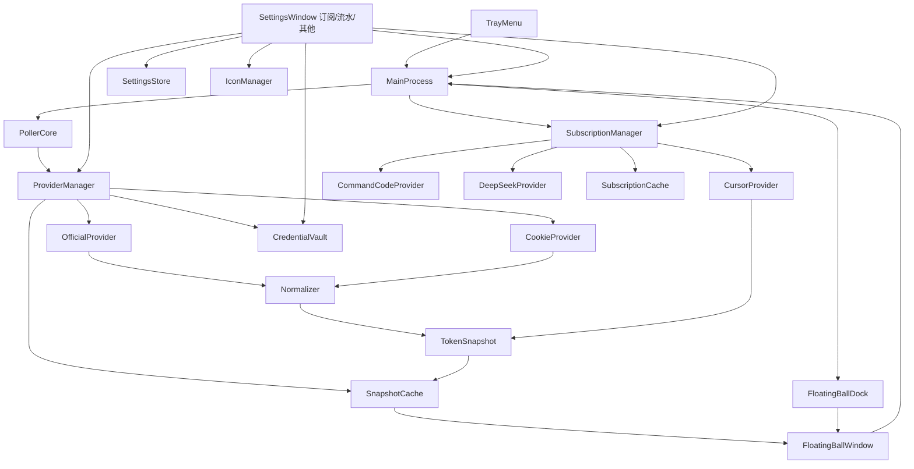

# Cursor Token Monitor — 项目参考文档

> Windows 桌面悬浮球，定期显示 Cursor 账号 **Cursor Models / Other Models** 用量与余量；设置窗口内按 **订阅 / 流水 / 其他** 三个分区承载订阅额度查询、用量流水与其他配置。  
> 本文档整合需求说明、架构设计、实现细节、使用与维护指南，便于后续查阅。

---

## 目录

1. [项目概述](#1-项目概述)
2. [快速开始](#2-快速开始)
3. [功能需求](#3-功能需求)
4. [架构设计](#4-架构设计)
5. [目录结构](#5-目录结构)
6. [数据模型与接口映射](#6-数据模型与接口映射)
7. [轮询与故障切换](#7-轮询与故障切换)
8. [安全设计](#8-安全设计)
9. [界面与交互](#9-界面与交互)
10. [配置项说明](#10-配置项说明)
11. [打包与发布](#11-打包与发布)
12. [验收清单](#12-验收清单)
13. [维护与扩展](#13-维护与扩展)
14. [风险与版本规划](#14-风险与版本规划)

---

## 1. 项目概述

| 项 | 说明 |
|---|---|
| 项目名称 | Cursor Token Monitor（Cursor Token 悬浮球） |
| 平台 | Windows |
| 技术栈 | Electron + TypeScript + React + Vite |
| 版本 | v1.0.0 |
| 目标用户 | 个人开发者（账号所有者本人） |

### 背景与目标

- **背景**：需要在桌面实时查看 Cursor 账号 token 余量，避免频繁打开网页或控制台。
- **目标**：提供轻量、常驻、可配置自动刷新的悬浮球，展示 Cursor Models 与 Other Models 用量概览、周期明细及余量；并在设置窗口内集中提供订阅额度查询（Cursor / Command Code / DeepSeek）与用量流水查询。
- **数据策略**：官方接口优先（`OfficialProvider`），连续失败后自动回退到 Dashboard Cookie 接口（`CookieProvider`）。Cookie 方案优先读取 `usage-summary` 汇总数据；`get-aggregated-usage-events` 用于 Included Usage 周期模型明细；`get-filtered-usage-events` 作为今日/周期 token 与回退补充，避免明细接口不稳定时影响主数据展示。订阅数据独立于该链路，由 `SubscriptionManager` 按提供方各自查询（见第 4 章）。

### 范围

**范围内：**
- Windows 悬浮球（拖拽、置顶、贴边半隐收起、托盘）
- Cursor Models / Other Models 余量与 Dashboard 用量指标展示（概览 / 用量切换）
- 设置窗口三分区 Tab：订阅 / 流水 / 其他（URL hash 定位，默认订阅）
- 订阅额度与用量查询：Cursor 周期用量、Command Code 额度与 5 小时/每周/每月限额、DeepSeek 余额与按月模型用量
- 用量流水按平台查询（Cursor / Command Code / DeepSeek）：日期预设与自定义范围、分页、手动刷新，字段对齐 cursor.com 控制台；结果按平台驻留内存缓存
- 系统托盘悬停展示概览用量摘要；右键提供设置 / 复位 / 退出
- 自动刷新与间隔配置（订阅页自动刷新共用同一份配置）
- 双 Provider 故障切换（Official ⇄ Cookie）
- Dashboard API 多端点候选与局部降级
- 凭据手动配置与连通性测试（Cursor Cookie、各订阅平台 API Key / 用量 Token）
- 订阅结果与快照本地缓存（打开即有数据，查询失败保留上次成功结果）
- 自定义应用图标（托盘/设置窗即时生效）

**范围外：**
- 跨平台（macOS / Linux）
- 多账号切换（首版单账号）
- 服务端中转
- 历史趋势图表（首版不做）

### 术语

| 术语 | 含义 |
|---|---|
| auto | Cursor Models 池（原 First-party models / Auto + Composer，含 Auto、Composer、Grok 等自有模型） |
| api | Other Models 池（原 API，非 Cursor 自有模型调用相关 token） |
| Provider | 数据获取单元（Official / Cookie） |
| TokenSnapshot | 统一后的展示数据结构 |

---

## 2. 快速开始

### 环境要求

- Node.js >= 16（推荐 18+）
- Windows 10/11

### 安装与运行

```bash
# 安装依赖
npm install

# 开发模式（热更新 + Electron；dev server 固定 http://localhost:5180，端口被占用会直接报错退出）
npm run dev

# 生产构建（Vite 编译渲染层与 Electron 主/预加载进程）
npm run build
npm start

# 类型检查（tsc --noEmit，不生成 dist-electron 冗余产物）
npm run typecheck

# 打包安装程序（typecheck + build + electron-builder）
npm run dist
```

### 首次使用

1. 启动应用，屏幕右下角出现悬浮球
2. 右键系统托盘 → **应用设置** 或 **查看流水**
3. 在浏览器 DevTools 中复制 `WorkosCursorSessionToken` 的值，或复制包含该字段的完整 `cursor.com` Cookie，粘贴并保存
4. 点击 **测试连接** 验证
5. 悬浮球按设定间隔自动刷新，展示 Cursor Models / Other Models 余量及数据来源

### 获取 Cookie 方法

1. 浏览器登录 [cursor.com](https://www.cursor.com)
2. 打开开发者工具（F12）→ Network
3. 刷新页面，任选 cursor.com 请求
4. 优先复制 `WorkosCursorSessionToken` 的值；也可以复制 Request Headers 中的 `Cookie` 完整值
5. 粘贴到设置页并保存（存储在 Windows 凭据库，非明文文件）

---

## 3. 功能需求

### FR-01 悬浮球显示

- 启动后显示悬浮球，支持拖拽与置顶
- 折叠态：总余量百分比（「余量」）+ 健康状态点 + 圆环进度
- 展开态：默认「概览」视图；有 Included Usage 数据时可切换至「用量」视图
- 贴边收起：AssistiveTouch 风格半隐圆球（闲置约半隐 + 半透明；悬停滑入变实）

### FR-02 明细展示

**概览视图：**

- 顶部 dashboard：总消耗百分比、进度条、周期 token 汇总、状态 pill、来源、上次刷新时间
- 四张 metric 卡片纵向排列：今日 Cursor Models、今日 Other Models、周期 Cursor Models、周期 Other Models（百分比 + token 明细）
- 退避 / 暂停 / 无数据等状态提示

**用量视图（有 Included Usage 数据时可用）：**

- 按模型聚合的 Included Usage 列表（Cursor Models / Other Models 分区，账单周期、tokens、占比）
- 列表区域独立滚动，概览视图无纵向滚动条

**通用：**

- `auto.remaining` / `auto.limit`、`api.remaining` / `api.limit`（接口提供时用于余量计算）
- 数据来源（official / cookie）
- stale 时状态 pill 显示「缓存数据」（不另设整页缓存提示条）

### FR-03 自动刷新与间隔配置

- 默认开启，默认间隔 **30 秒**
- 可配置范围：**30 – 3600 秒**
- 非法输入拦截并提示，修改后立即生效并持久化；历史配置若低于 30 秒，启动时自动钳制
- 支持暂停 / 恢复；暂停期间可手动刷新
- 刷新中：悬浮球与概览面板有加载反馈（旋转刷新按钮、双电流边框等）

### FR-04 数据源策略与容错

- 优先 `OfficialProvider`
- 连续失败 **3 次**（可配置）后切换 `CookieProvider`
- 回退后每 **120 秒** 探测官方接口是否恢复，恢复则自动切回
- UI 显示当前来源标签

### FR-05 Cookie 配置与测试

- 手动粘贴 Cookie
- 测试连接：成功 / 失败 + 原因；成功时展示结构化详情（耗时、数据源、总消耗、账单周期、Token 配额、用量分项、Included Usage 状态等）
- 一键清除凭据

### FR-06 托盘与生命周期

- 托盘右键菜单：**设置**、**复位**、**退出**（左键点击弹出同一菜单）。设置会打开设置窗口的默认分区；复位把悬浮球恢复到主屏右下角默认位置并恢复可见
- 不再提供查看流水 / 立即刷新 / 暂停恢复菜单项——这些能力分别位于设置窗口的流水分区与悬浮球面板内
- 悬停托盘图标：多行概览用量摘要（总消耗、今日/周期 Cursor Models 与 Other Models 分项；模型名按较长标签补齐对齐，末行合并「来源 + 更新时间」），随快照刷新更新，无快照时显示「暂无数据」
- 托盘图标：自定义图标优先（`userData/custom-icon.png`，居中裁剪为正方形后按 64×64 加载以覆盖各 DPI），否则使用 `build/icon.png` 默认图标
- 关闭悬浮窗后驻留托盘，不强制退出

### FR-07 贴边缘自动收起

- 拖拽悬浮球贴近屏幕边缘松手后自动收起为半隐圆球（四边对称）
- 悬停滑入变实；点击展开或向外拖出可恢复完整显示
- 设置项 `edgeAutoDockEnabled`（默认开启）可开关

### FR-08 自定义应用图标

- 设置页可选择本地图片作为应用图标
- 托盘与设置窗口即时生效
- 支持恢复默认图标；安装包/任务栏图标需重新打包后更新

### FR-09 快照本地缓存

- 成功刷新后将 `TokenSnapshot` 持久化到 `%APPDATA%/cursor-token-monitor/snapshot-cache.json`
- 启动时或请求失败时展示缓存数据，标记 `stale = true` 并提示用户

### FR-10 用量流水

- 位于设置窗口「流水」分区的 Tab 页（不再单独开窗），通过 `fetch-usage-flow` IPC 拉取
- **默认最近 1 天**：进入页面时若主进程内存缓存有该平台上次成功结果则直接回填展示（不重复请求）；无缓存则自动请求最近 1 天
- 内存缓存按平台保存「查询条件 + 上次成功结果」（不落盘，应用重启后清空）；点「刷新」，或切换筛选 / 分页 / 每页条数时更新
- 平台筛选：Cursor、Command Code、DeepSeek（命中该平台缓存则回填，否则重置为最近 1 天并自动请求）
- 日期快捷筛选：1d / 7d / 30d / MTD / Last month，以及自定义日期范围（按东八区日历日）
- 服务端分页：每页可选 10 / 20 / 50 / 100，默认 20；提供首页 / 上一页 / 下一页 / 末页
- 列表五列对齐控制台：Date (UTC+8)、Type、Model、Tokens、Cost；Token 统一按万 / 亿格式，缺字段显示 `-`
- 字段映射：`default`→`auto`；`maxMode` 显示蓝色 MAX 徽标；Included / Free / Usage-based 等 Type/Cost 与控制台一致（映射见 `src/shared/usageFlowFormat.ts`）
- 数据来源：Cursor 走 `get-filtered-usage-events`（与控制台同源）；DeepSeek 走 `/api/v0/usage/amount`；Command Code 走 `/internal/usage?from=…&to=…&limit=…`（仅浏览器会话可访问，需在订阅页配置「流水凭据」，API Key 会返回 401；服务端 `limit` 上限 100，按 `offset` 分页，响应体为 `{ usages: [...] }`）
- 无凭据时提示需配置 Cookie / 平台凭据

### FR-11 订阅额度与用量查询

- 位于设置窗口「订阅」分区（默认分区），按提供方 Tab 切换，**注册顺序即 Tab 顺序：Cursor → Command Code → DeepSeek**
- 三个提供方数据形态不同：
  - **Cursor**：周期用量看板，复用主链路的 `TokenSnapshot`（本身不发独立请求）
  - **Command Code**：额度看板——剩余额度（月度 / 购买 / 赠送）、当期消耗 / 请求数 / Tokens、套餐与续期日期，以及 5 小时 / 每周 / 每月三段限额计量条
  - **DeepSeek**：各币种余额，且支持按月查询模型用量明细（当前仅 DeepSeek 提供「用量」）
- 凭据区按提供方切换：Cursor 用 `WorkosCursorSessionToken`（Cookie，支持测试连接并展示结构化结果）；其余用 API Key；支持按月用量的提供方另有独立的「用量 Token」；Command Code 另有独立的「流水凭据（网页会话）」（逐条流水仅浏览器会话可访问，API Key 返回 401）
- 刷新策略：进入订阅分区会刷新全部已配置提供方；页内切换提供方只读缓存、不发请求；自动刷新读取「其他」分区的 `autoRefreshEnabled` / `refreshIntervalSec`
- 结果落盘到 `userData/subscription-cache.json`（含版本号，12 小时有效期）：打开即有数据；查询失败保留上次成功结果并给出黄色提示，不破坏缓存
- 提示分级：未配置 / 无记录为蓝色 info，最近一次查询失败为黄色 warn，查询报错为红色 error

### FR-12 设置窗口结构

- 设置窗口 1120×720（最小 800×480），顶部 Tab 切换三个分区：**订阅、流水、其他**（默认订阅，`#subscriptions` / `#flow` / `#settings` 定位）
- 「其他」分区四个卡片，宽窗口下按三列网格排列（数据刷新 / 悬浮球 / 外观同处一行，「核心功能」卡跨列占满剩余高度）：
  - **数据刷新**：自动刷新开关 + 刷新间隔（30–3600 秒，整数校验，600ms 防抖自动保存、失焦立即保存）
  - **悬浮球**：贴边缘自动收起开关
  - **外观**：自定义图标选择 / 恢复默认（即时生效于托盘与设置窗口）
  - **核心功能**：内容由 `README.md` 派生（见下）
- 「核心功能」卡通过 Vite `?raw` 在构建期导入 `README.md`，提取开头简介与「范围内」清单渲染，改 README 即同步；内容超出卡片高度时在卡内滚动

### 非功能需求

| 类别 | 要求 |
|---|---|
| 性能 | 冷启动 5 秒内显示悬浮球；单次请求超时默认 10 秒 |
| 稳定性 | 接口失败不崩溃；指数退避重试 |
| 安全 | Cookie 不明文存储；日志脱敏 |
| 可维护性 | Provider 与 UI 解耦；关键行为可追踪日志 |

---

## 4. 架构设计



### 模块职责

| 模块 | 文件 | 职责 |
|---|---|---|
| 主进程 | `electron/main.ts` | 生命周期、IPC、协调各模块 |
| 边缘吸附 | `electron/floatingBallDock.ts` | 贴边半隐、悬停滑入、窗口 undock |
| 图标管理 | `electron/iconManager.ts` | 自定义图标读写与预览 |
| 悬浮窗 | `electron/windows/floatingBall.ts` | 无边框置顶窗口 |
| 设置窗 | `electron/windows/settings.ts` | 设置窗口（订阅 / 流水 / 其他 三分区容器，按 tab 参数定位） |
| 托盘 | `electron/tray.ts` | 系统托盘菜单与悬停 tooltip |
| 预加载 | `electron/preload.ts` | 安全 IPC 桥接 |
| 开发态 URL | `src/shared/devServer.ts` | dev server 端口与 URL 的单一来源（5180） |
| 轮询器 | `src/core/poller.ts` | 定时刷新、退避、状态机 |
| 快照缓存 | `src/core/SnapshotCache.ts` | 本地快照持久化与加载 |
| 流水缓存 | `src/core/UsageFlowCache.ts` | 流水视图内存缓存（按平台，进程内、不落盘） |
| Provider 管理 | `src/core/providers/ProviderManager.ts` | 优先级切换、故障转移、流水拉取 |
| 官方数据源 | `src/core/providers/OfficialProvider.ts` | 无 Cookie 请求 |
| Cookie 数据源 | `src/core/providers/CookieProvider.ts` | 带 Cookie 请求（含流水分页） |
| 标准化 | `src/core/normalizer.ts` | 统一字段映射、流水页构建 |
| 订阅管理 | `src/core/subscriptions/SubscriptionManager.ts` | 订阅提供方注册、分发查询与凭据管理 |
| 订阅缓存 | `src/core/subscriptions/SubscriptionCache.ts` | 订阅结果落盘（版本号 + 12h 有效期 + 失败保留） |
| Cursor 订阅源 | `src/core/subscriptions/CursorProvider.ts` | 复用主链路快照构建周期用量 |
| Command Code 订阅源 | `src/core/subscriptions/CommandCodeProvider.ts` | alpha 接口额度 / 套餐 / 三段限额；会话凭据拉逐条流水 |
| DeepSeek 订阅源 | `src/core/subscriptions/DeepSeekProvider.ts` | 余额 + 按月模型用量 |
| 设置存储 | `src/settings/SettingsStore.ts` | JSON 持久化 |
| 凭据库 | `src/security/CredentialVault.ts` | keytar / safeStorage |
| 日志 | `src/utils/logger.ts` | 敏感信息脱敏 |
| 格式化 | `src/shared/format.ts` | 展示格式化、托盘 tooltip、概览/用量构建 |
| 流水格式化 | `src/shared/usageFlowFormat.ts` | Type/Model/Tokens/Cost 对齐控制台 |
| 流水日期 | `src/shared/usageFlowDates.ts` | 东八区日期预设与自定义范围 |
| 流水分页 | `src/shared/usageFlowPagination.ts` | 每页条数选项与默认值 |
| 悬浮球 UI | `src/renderer/App.tsx` | 折叠/展开、概览/用量切换 |
| 设置 UI 路由 | `src/renderer/pages/SettingsPage.tsx` | 三分区 Tab 路由与 hash 同步 |
| Tab 切换 | `src/renderer/components/TabBar.tsx` | 通用 Tab 切换组件 |
| 其他分区 UI | `src/renderer/components/SettingsTabContent.tsx` | 数据刷新 / 悬浮球 / 外观 / 核心功能卡 |
| 核心功能卡 | `src/renderer/components/ProjectFeaturesCard.tsx` | 由 `README.md` 派生功能清单（`?raw`） |
| 订阅 UI | `src/renderer/pages/SubscriptionsPage.tsx` | 订阅分区：提供方切换、刷新、凭据配置 |
| 订阅面板 | `src/renderer/components/SubscriptionPanels.tsx` | Cursor / Command Code / DeepSeek 展示面板 |
| 订阅工具 | `src/renderer/components/SubscriptionUtils.ts` | 订阅页工具函数 |
| 提供方切换 | `src/renderer/components/ProviderSwitcher.tsx` | 订阅提供方 Tab 与健康点 |
| 流水 UI | `src/renderer/pages/FlowPage.tsx` | 平台筛选、分页、手动刷新 |
| 流水筛选 / 分页 | `src/renderer/components/UsageFlowFilters.tsx`、`UsageFlowPagination.tsx` | 日期范围与分页控件 |
| 提示条 | `src/renderer/components/ErrorHint.tsx` | 分级提示（info / warn / error） |
| 连接测试面板 | `src/renderer/components/TestConnectionResultPanel.tsx` | 测试连接结构化结果 |
| 指标行 | `src/renderer/components/MetricRow.tsx` | Dashboard metric 明细展示 |
| Included 列表 | `src/renderer/components/IncludedUsageTable.tsx` | Included Usage 用量明细 |
| 流水表格 | `src/renderer/components/UsageFlowTable.tsx` | 用量流水五列展示 |

> 注：`electron/windows/flow.ts`、`electron/windows/subscriptions.ts` 及其入口 HTML 仍保留在仓库中，但当前已无引用——流水与订阅均由设置窗口的对应分区承载（见第 9 章）。

---

## 5. 目录结构

```
cursor_monitor/
├── electron/                    # Electron 主进程
│   ├── main.ts                  # 入口、IPC 注册、生命周期
│   ├── preload.ts               # 渲染进程 API 桥接
│   ├── tray.ts                  # 系统托盘菜单 / 悬停 tooltip / 图标
│   ├── floatingBallDock.ts      # 边缘吸附与半隐
│   ├── iconManager.ts           # 自定义图标管理
│   └── windows/
│       ├── floatingBall.ts      # 悬浮球窗口（固定 300 宽）
│       ├── settings.ts          # 设置窗口（订阅 / 流水 / 其他 三分区容器）
│       ├── flow.ts              # 流水窗口（保留，当前无引用）
│       └── subscriptions.ts     # 其他订阅窗口（保留，当前无引用）
├── src/
│   ├── core/
│   │   ├── poller.ts            # 轮询与状态机
│   │   ├── SnapshotCache.ts     # 快照本地缓存
│   │   ├── UsageFlowCache.ts    # 流水视图内存缓存（按平台，不落盘）
│   │   ├── normalizer.ts        # 字段标准化 / 流水页构建
│   │   ├── snapshotMerge.ts     # 快照合并
│   │   ├── providers/
│   │   │   ├── OfficialProvider.ts
│   │   │   ├── CookieProvider.ts
│   │   │   └── ProviderManager.ts
│   │   └── subscriptions/
│   │       ├── types.ts              # SubscriptionProvider 接口
│   │       ├── SubscriptionManager.ts # 注册 / 分发 / 凭据
│   │       ├── SubscriptionCache.ts   # 落盘缓存
│   │       ├── CursorProvider.ts      # Cursor 周期用量（复用快照）
│   │       ├── CommandCodeProvider.ts # Command Code 额度看板
│   │       └── DeepSeekProvider.ts    # DeepSeek 余额 + 按月用量
│   ├── settings/
│   │   └── SettingsStore.ts     # 本地配置
│   ├── security/
│   │   └── CredentialVault.ts   # 凭据安全存储
│   ├── shared/
│   │   ├── types.ts             # 类型定义
│   │   ├── subscriptionTypes.ts # 订阅相关类型
│   │   ├── format.ts            # 展示格式化 / 托盘 tooltip
│   │   ├── usageFlowDates.ts    # 流水日期范围
│   │   ├── usageFlowFormat.ts   # 流水字段映射
│   │   ├── usageFlowPagination.ts # 流水分页常量
│   │   └── devServer.ts         # 开发态 dev server 端口与 URL
│   ├── utils/
│   │   └── logger.ts            # 脱敏日志
│   └── renderer/                # React 渲染层
│       ├── App.tsx              # 悬浮球
│       ├── main.tsx             # 悬浮球入口
│       ├── settings-main.tsx    # 设置窗入口
│       ├── flow-main.tsx        # 流水窗入口（保留）
│       ├── subscriptions-main.tsx # 其他订阅窗入口（保留）
│       ├── pages/
│       │   ├── SettingsPage.tsx      # 三分区 Tab 路由
│       │   ├── FlowPage.tsx          # 流水
│       │   └── SubscriptionsPage.tsx # 订阅
│       └── components/
│           ├── TabBar.tsx
│           ├── SettingsTabContent.tsx   # 其他分区四张卡片
│           ├── ProjectFeaturesCard.tsx  # 核心功能（读 README）
│           ├── ProviderSwitcher.tsx
│           ├── SubscriptionPanels.tsx
│           ├── SubscriptionUtils.ts
│           ├── UsageFlowTable.tsx
│           ├── UsageFlowFilters.tsx
│           ├── UsageFlowPagination.tsx
│           ├── IncludedUsageTable.tsx
│           ├── TestConnectionResultPanel.tsx
│           ├── ErrorHint.tsx
│           ├── MetricRow.tsx
│           └── TokenBadge.tsx
├── docs/
│   └── changes/                 # 代码变更归档（见 .cursor/rules/change-archive.mdc）
├── index.html                   # 悬浮球入口
├── settings.html                # 设置窗口入口（承载三分区）
├── flow.html                    # 流水入口（保留，当前无引用）
├── subscriptions.html           # 其他订阅入口（保留，当前无引用）
├── vite.config.ts
├── tsconfig.json
├── tsconfig.electron.json
├── electron-builder.yml
├── package.json
├── requirements.md              # 原始需求说明书（已合并至本文档）
└── release/                     # 打包产物
```

---

## 6. 数据模型与接口映射

### TokenSnapshot（统一输出）

```json
{
  "source": "official",
  "auto": { "remaining": 120000, "limit": 200000, "resetAt": "2026-07-31T00:00:00Z" },
  "api": { "remaining": 80000, "limit": 100000, "resetAt": "2026-07-31T00:00:00Z" },
  "fetchedAt": "2026-07-03T04:00:00Z",
  "stale": false,
  "rawVersion": "official:v1"
}
```

| 字段 | 类型 | 说明 |
|---|---|---|
| source | `official \| cookie` | 数据来源 |
| auto / api | `{ remaining, limit, resetAt? }` | 余量信息，缺失为 null |
| metrics | `UsageMetrics` | dashboard 百分比、周期 token、今日 token/消耗等补充指标 |
| fetchedAt | ISO 8601 | 抓取时间 |
| stale | boolean | 是否过期/不完整 |
| rawVersion | string | 接口版本标识，便于排障 |

### OfficialProvider 映射

默认端点：`https://www.cursor.com/api/usage`

```json
{
  "autoRemaining": 120000,
  "autoLimit": 200000,
  "autoResetAt": "2026-07-31T00:00:00Z",
  "apiRemaining": 80000,
  "apiLimit": 100000,
  "apiResetAt": "2026-07-31T00:00:00Z"
}
```

| 原始字段 | TokenSnapshot 字段 |
|---|---|
| autoRemaining | auto.remaining |
| autoLimit | auto.limit |
| autoResetAt | auto.resetAt |
| apiRemaining | api.remaining |
| apiLimit | api.limit |
| apiResetAt | api.resetAt |

`normalizer.ts` 同时支持嵌套格式（`auto.remaining`、`usage.auto.remaining` 等）。

### CookieProvider 映射（Dashboard 替代方案）

默认候选端点（请求头带 Cookie）：

1. `https://cursor.com/api/usage-summary`
2. `https://www.cursor.com/api/usage-summary`
3. `https://cursor.com/api/dashboard/usage-summary`
4. `https://www.cursor.com/api/dashboard/usage-summary`
5. 用户配置的 `cookieEndpoint`

这些端点返回 dashboard 汇总用量，是当前更稳定的主数据来源。实现上每个候选端点独立超时，当前一个端点超时、404、5xx 或返回不可用内容时，会继续尝试下一个候选端点。

```json
{
  "billingCycleStart": "2026-07-01T00:00:00Z",
  "billingCycleEnd": "2026-07-31T00:00:00Z",
  "individualUsage": {
    "plan": {
      "limit": 20,
      "remaining": 12,
      "totalPercentUsed": 40,
      "apiPercentUsed": 10,
      "autoPercentUsed": 30
    }
  }
}
```

| 原始字段 | TokenSnapshot 字段 |
|---|---|
| individualUsage.plan.autoPercentUsed + limit | auto.remaining / auto.limit / metrics.autoUsedPercent |
| individualUsage.plan.apiPercentUsed + limit | api.remaining / api.limit / metrics.apiUsedPercent |
| individualUsage.plan.totalPercentUsed | metrics.totalUsedPercent |
| billingCycleEnd | auto.resetAt / api.resetAt |

### Usage Events 明细补充

补充端点：

1. `https://cursor.com/api/dashboard/get-aggregated-usage-events`（Billing Included Usage 同源聚合，优先）
2. `https://www.cursor.com/api/dashboard/get-aggregated-usage-events`
3. `https://cursor.com/api/dashboard/get-filtered-usage-events`（今日/周期 token 与 Included Usage 回退）
4. `https://www.cursor.com/api/dashboard/get-filtered-usage-events`

`get-aggregated-usage-events` 返回周期内按模型汇总的 tokens / cost，用于展开面板底部 **Included Usage**，与控制台 Billing 口径对齐，无需事件分页。

`get-filtered-usage-events` 用于补充周期内 token 总量和今日 token/消耗，并在聚合接口不可用时回退构建 Included Usage。该端点依赖 `WorkosCursorSessionToken` 中的 `userId`，应用会从 `userId::jwt`、URL 编码格式或 JWT `sub` 中提取。若事件接口失败、超时或无法提取 `userId`，应用仍会展示 `usage-summary` 的汇总百分比，并将 token 明细保持为 `null`。

用量流水窗口通过同一 `get-filtered-usage-events` 端点**独立分页拉取**（不写入 `TokenSnapshot`，避免快照缓存膨胀）。展示映射见 `src/shared/usageFlowFormat.ts`：

| 控制台列 | 规则 |
|---|---|
| Date | `timestamp` 毫秒字符串先转 number，格式化为东八区 |
| Type | 显式 `kind` 优先（Included / Free / Usage-based 等）；无 token 且非 Usage-based 时默认 Free |
| Model | `default` → `auto`；`maxMode: true` 时附加蓝色 MAX 徽标 |
| Tokens | 有用量用「万」等格式；零/空显示 `-` |
| Cost | Included / Free 显示文案本身；Usage-based 等显示金额 |

### 异常处理规则

- 单字段缺失 → 该字段为 `null`，不影响其他字段
- 两类余量均缺失 → `stale = true`，提示「数据不完整」
- 事件明细失败 → 保留汇总数据，仅缺失 token 明细
- 汇总解析失败 → 保留最近成功快照，进入退避重试
- 日志禁止输出完整 Cookie / Authorization

---

## 7. 轮询与故障切换

### 自动刷新状态机

| 状态 | 说明 |
|---|---|
| idle | 初始 |
| running | 正常轮询 |
| backoff | 失败退避等待 |
| paused | 用户暂停 |

| 事件 | 行为 |
|---|---|
| start | → running |
| refreshSuccess | 保持 running，重置失败计数 |
| refreshFail | 失败 +1，必要时 → backoff |
| pause | → paused |
| resume | paused → running |
| manualRefresh | 任意状态触发一次，paused 不改变暂停状态 |

### 退避策略

失败时：`30s → 60s → 120s → 300s`（上限 5 分钟）  
成功后：恢复为用户设置的刷新间隔

### Provider 切换流程

```
OfficialProvider 请求
    │
    ├─ 成功 → 展示数据，source = official
    │
    └─ 连续失败 ≥ failureThreshold（默认 3 次）
           │
           ├─ Cookie 已配置 → 切换 CookieProvider
           │                    ├─ usage-summary 成功 → 展示汇总数据
           │                    ├─ usage events 成功 → 补充 token 明细
           │                    ├─ usage events 失败 → 仅展示汇总数据
           │                    └─ 每 120s 探测 Official 是否恢复
           │
           └─ Cookie 未配置 → 保留上次快照，stale = true，提示配置 Cookie
```

---

## 8. 安全设计

| 措施 | 实现 |
|---|---|
| Cookie 存储 | Windows Credential Manager（keytar），失败时 safeStorage 加密本地文件 |
| 订阅凭据存储 | API Key 与「用量 Token」同样走 `CredentialVault`，按账户名区分（如 `commandcode-api-key`、`deepseek-api-key`、`deepseek-usage-token`） |
| Command Code Key 解析 | 三级优先级：手动录入（可覆盖）→ 环境变量 `COMMAND_CODE_API_KEY` / `COMMANDCODE_API_KEY` → 只读 `~/.commandcode/auth.json`；读取失败静默跳过，不记录凭据内容 |
| 配置文件 | 仅存非敏感项（刷新间隔、端点 URL），不含 Cookie / API Key |
| 日志脱敏 | `logger.ts` 对 cookie / authorization / session 等字段打码 |
| 用户提示 | 设置窗口订阅分区说明凭据仅用于本人账号查询 |
| 清除凭据 | 一键删除，之后不再发起对应平台的请求 |

---

## 9. 界面与交互

### 悬浮球

| 状态 | 内容 |
|---|---|
| 折叠 | 圆形球体、余量百分比、圆环进度、健康点（绿/黄/蓝/灰） |
| 贴边收起 | 半隐圆球（闲置约半隐 + opacity 0.4；悬停滑入变实），点击展开或拖出恢复 |
| 展开 · 概览 | 总消耗 dashboard、4 张纵向 metric 卡片、状态/来源/时间、刷新/设置/收起；面板进出场动画 |
| 展开 · 用量 | Included Usage 分区列表（有数据时底部分段「概览 / 用量」），长模型名自动换行 |

健康点含义：
- **绿**：数据正常
- **黄**：数据过期或退避中（stale 时 pill 显示「缓存数据」）
- **蓝**：自动刷新已暂停，或正在刷新
- **灰**：暂无数据

未贴边窗口固定 **300×548**，展开/收起与概览/用量切换不再改变窗体尺寸；贴边 peek 高度为 **448**（宽度同 300）。

### 设置窗口（三分区）

窗口 1120×720（最小 800×480），顶部 Tab：**订阅 / 流水 / 其他**，默认订阅，`#subscriptions` / `#flow` / `#settings` 定位。

**订阅**（默认分区）

- 提供方 Tab：Cursor → Command Code → DeepSeek，带健康点（绿=已配置且数据正常 / 灰=未配置 / 黄=最近一次查询失败）
- 顶部「刷新」按钮刷新全部已配置提供方；meta 行显示查询时间与自动刷新状态（间隔与开关跟随「其他」分区配置）
- 面板随提供方变化：
  - Cursor：周期用量（总用量、来源、账单周期、Cursor Models / Other Models 百分比与模型明细）
  - Command Code：账户额度（剩余额度拆分、当期消耗 / 请求数 / Tokens、套餐与续期）+ 5 小时 / 每周 / 每月三段限额计量条
  - DeepSeek：各币种余额 + 按月模型用量表
- 凭据配置区可折叠：Cursor 填 `WorkosCursorSessionToken` 并可测试连接（结构化结果）；其余平台填 API Key；支持按月用量的平台另有独立的「用量 Token」
- 进入分区即有缓存数据；查询失败保留上次成功结果并给出黄色提示

**流水**

- 平台切换：Cursor / DeepSeek
- 日期快捷：1d / 7d / 30d / MTD / Last month + 自定义范围
- 进入分区不自动加载，点击「刷新」才请求；切换平台不自动请求；切换筛选 / 分页 / 每页条数会重新拉取
- 表格：Date (UTC+8)、Type、Model（含 MAX 徽标）、Tokens、Cost
- 分页：每页 10 / 20 / 50 / 100（默认 20），首页 / 上一页 / 下一页 / 末页
- 有模型统计时展示按模型 Tokens 占比条形图

**其他**

- 数据刷新：自动刷新开关 + 间隔（30–3600 秒，整数校验，600ms 防抖自动保存）
- 悬浮球：贴边缘自动收起开关
- 外观：自定义应用图标（选择 / 恢复默认）
- 核心功能：由 `README.md` 派生的项目功能清单，改 README 即同步

### 托盘

**悬停提示**（多行，模型名补齐对齐，随快照更新）：

```text
总消耗 12.34%
今日 Cursor Models 2.30%
今日 Other Models  1.20%
周期 Cursor Models 5.00%
周期 Other Models  10.00%
来源 官方  更新 14:32:05
```

**右键菜单**

- 设置（打开设置窗口默认分区）
- 复位（悬浮球回到主屏右下角默认位置并恢复可见）
- 退出

---

## 10. 配置项说明

配置文件位置：`%APPDATA%/cursor-token-monitor/settings.json`

| 配置项 | 默认值 | 说明 |
|---|---|---|
| autoRefreshEnabled | true | 是否自动刷新 |
| refreshIntervalSec | 30 | 刷新间隔（**30**–3600） |
| requestTimeoutSec | 10 | 单次请求超时 |
| officialEndpoint | `https://www.cursor.com/api/usage` | 官方接口 |
| cookieEndpoint | `https://cursor.com/api/usage-summary` | 用户自定义 Cookie 汇总接口候选 |
| failureThreshold | 3 | 切换 Provider 的失败次数阈值 |
| edgeAutoDockEnabled | true | 贴边缘自动收起 |
| customIconPath | null | 自定义图标路径（null 为默认） |

修改端点或映射逻辑见 [维护与扩展](#13-维护与扩展)。

---

## 11. 打包与发布

### 前置步骤：生成图标

项目使用 `build/icon.png` 作为图标源文件。打包前必须将其转换为多尺寸 `.ico` 文件（NSIS 安装包需要）：

```powershell
powershell -ExecutionPolicy Bypass -File scripts\create-icon.ps1
```

脚本会从 `build/icon.png` 居中裁剪为正方形，生成 16/32/48/256 四种尺寸的 `build/icon.ico`。

> **注意**：每次更换 `build/icon.png` 后都需要重新执行此脚本，否则 NSIS 构建会因无法读取图标而失败。

### 执行打包

```bash
npm run dist
```

等价于 `npm run typecheck && npm run build && electron-builder`：

1. **typecheck** — `tsc --noEmit` 类型检查，不生成冗余 JS
2. **build** — Vite 编译 `dist/`（渲染层）与 `dist-electron/main.js`、`preload.js`（主/预加载进程）
3. **electron-builder** — 打包 NSIS 安装包与 portable 便携版

产物位于 `release/`：

| 文件 | 说明 |
|---|---|
| `Cursor Token Monitor Setup 1.0.0.exe` | NSIS 安装包 |
| `Cursor Token Monitor 1.0.0.exe` | 便携版 |
| `win-unpacked/` | 免安装目录 |

> 当前环境打包时禁用了代码签名（`signAndEditExecutable: false`）。正式发布建议配置证书签名。

### 体积优化策略

| 优化项 | 配置 | 效果 |
|---|---|---|
| 收窄打包输入 | `files` 仅含 `dist-electron/main.js`、`preload.js`，排除 `*.map` | 避免 tsc 重复产物进入 asar |
| 依赖归类 | `react`/`react-dom` 置于 devDependencies | 避免重复打入 asar |
| Locale 裁剪 | `electronLanguages: [en-US, zh-CN]` | locales 从 ~36 MB 降至 ~1 MB |
| 压缩级别 | `compression: maximum` | NSIS 安装包进一步压缩 |

当前典型体积（x64）：便携版 ~67 MB，安装包 ~67 MB（较初始 ~74 MB 减少约 7 MB）。

### 打包前注意事项

**打包前必须关闭已运行的应用**，否则 `electron-builder` 会因无法删除正在使用的 `Cursor Token Monitor.exe` 而失败，报错 `Access is denied`。

可通过以下命令强制关闭：

```powershell
Get-Process -Name "Cursor Token Monitor" -ErrorAction SilentlyContinue | Stop-Process -Force
```

---

## 12. 验收清单

- [ ] 启动后 5 秒内出现悬浮球，可拖拽、置顶、贴边半隐收起
- [ ] 折叠态显示余量百分比；展开概览可见总消耗与 4 张纵向 metric 卡片
- [ ] 有 Included Usage 时可在概览/用量间切换，概览无纵向滚动
- [ ] 稳定展示 Cursor Models / Other Models 数值与 Dashboard 指标，标注数据来源
- [ ] 自动刷新默认开启，间隔可改（30–3600 秒）且立即生效
- [ ] 非法间隔输入被拦截，轮询不崩溃
- [ ] 官方接口失败后自动回退 Cookie，界面有提示
- [ ] 清除凭据后停止敏感请求，UI 给出引导
- [ ] 快照缓存在启动/失败时可展示 stale 数据（状态 pill 标识）
- [ ] 托盘悬停显示多行概览用量（模型名列对齐），随刷新更新
- [ ] 托盘右键含设置、复位、退出；左键点击弹出同一菜单
- [ ] 设置窗口三分区（订阅 / 流水 / 其他）可切换，默认订阅且 hash 定位有效
- [ ] 订阅分区三个提供方可切换，未配置时给出引导并显示灰色健康点
- [ ] 订阅分区「刷新」覆盖全部已配置提供方；重新进入分区立即显示缓存
- [ ] Command Code 展示额度与 5 小时/每周/每月限额；DeepSeek 可按月查询模型用量
- [ ] 订阅查询失败时保留上次成功结果并给出黄色提示，不显示空白
- [ ] 流水分区需手动点「刷新」加载，可按平台与日期筛选、可改每页条数
- [ ] 「其他」分区改刷新间隔后，订阅页自动刷新同步生效
- [ ] 「其他」分区四张卡片在默认窗口下按三列排列，核心功能卡内容与 README「范围内」清单一致
- [ ] 自定义图标可即时生效于托盘与设置窗
- [ ] 安装包可在 Windows 环境安装运行

---

## 13. 维护与扩展

### 接口变更时改哪里

**主链路（Cursor 用量）**——接口字段或路径变化时通常只需改以下文件，**无需动 UI**：

1. **`src/core/providers/OfficialProvider.ts`** — 官方请求 URL、Header
2. **`src/core/providers/CookieProvider.ts`** — Cookie 请求 URL、Header（含流水分页）
3. **`src/core/normalizer.ts`** — 字段映射规则、流水页构建
4. **`src/shared/usageFlowFormat.ts`** — 流水 Type/Model/Tokens/Cost 展示映射
5. **`src/shared/types.ts`** — 如有新原始响应结构，补充类型

**订阅平台**——改动同样收敛在对应 Provider 与其展示面板：

1. **`src/core/subscriptions/CommandCodeProvider.ts`** — alpha 接口（whoami / billing / usage summary）与字段解析
2. **`src/core/subscriptions/DeepSeekProvider.ts`** — 余额与按月用量接口
3. **`src/core/subscriptions/CursorProvider.ts`** — Cursor 看板字段映射（数据来自主链路快照）
4. **`src/core/subscriptions/SubscriptionCache.ts`** — 结果结构变化时同步提升 `CACHE_VERSION`（版本不符会丢弃旧缓存）
5. **`src/renderer/components/SubscriptionPanels.tsx`** — 展示字段与排版

### 新增 Provider

**主链路（TokenProvider）**

1. 在 `src/core/providers/` 新建 Provider 类，实现 `TokenProvider` 接口
2. 在 `ProviderManager.ts` 注册优先级与切换逻辑
3. 在 `normalizer.ts` 添加对应 normalize 函数

**订阅提供方（SubscriptionProvider）**

1. 在 `src/core/subscriptions/` 新建类，实现 `SubscriptionProvider` 接口（`id` / `label` / 凭据账号 / `isConfigured` / `fetchInfo`，可选 `fetchUsage`——实现它即表示支持按月用量）
2. 在 `SubscriptionManager` 构造函数中注册，**注册顺序即订阅页 Tab 顺序**
3. 在 `SubscriptionPanels.tsx` 补对应展示面板，并在 `SubscriptionsPage.tsx` 的分发处接入

### IPC 接口一览

| 通道 | 方向 | 说明 |
|---|---|---|
| get-snapshot | invoke | 获取当前 TokenSnapshot |
| get-poller-state | invoke | 获取轮询状态 |
| get-settings / update-settings | invoke | 读取 / 更新配置（含刷新间隔校验，变更后广播 `settings-changed`） |
| save-cookie / clear-cookie / has-cookie | invoke | Cookie 保存 / 清除 / 状态查询 |
| test-connection | invoke | 测试 Cookie 连接（结构化结果） |
| manual-refresh / toggle-pause | invoke | 手动刷新 / 暂停恢复 |
| subscription-list-providers | invoke | 订阅提供方元数据列表（顺序即 Tab 顺序） |
| subscription-get-cached | invoke | 读取订阅缓存快照 |
| subscription-save-key / subscription-clear-key | invoke | 保存 / 清除订阅凭据 |
| subscription-fetch-info | invoke | 拉取指定提供方账户与额度信息 |
| subscription-fetch-usage | invoke | 拉取指定提供方按月用量（校验月份 / 年份） |
| fetch-usage-flow | invoke | 按平台 / 日期范围 / 页码拉取用量流水（成功后写入内存缓存） |
| flow-get-cached | invoke | 读取流水内存缓存快照（按平台的查询条件 + 上次成功结果） |
| set-orb-mode-async | invoke | 设置悬浮球模式（异步版） |
| get-cursor-in-window | invoke | 光标是否在窗口内及相对坐标 |
| get-icon-preview / select-custom-icon / clear-custom-icon | invoke | 图标预览 / 选择 / 恢复默认 |
| snapshot-updated | event | 快照更新推送（仅悬浮球） |
| poller-state | event | 轮询状态推送（仅悬浮球） |
| dock-state-changed | event | 贴边状态变更（edge 或 null，仅悬浮球） |
| settings-changed | event | 配置变更推送（广播到所有窗口） |
| open-settings | send | 打开设置窗口（默认分区） |
| open-flow | send | 打开设置窗口的流水分区 |
| open-subscriptions | send | 打开设置窗口的订阅分区 |
| set-orb-mode | send | 设置悬浮球窗口模式（collapsed / hover / expanded） |
| set-expanded | send | 空实现，仅保留向后兼容 |
| set-expanded-panel-layout | send | 切换展开面板布局（概览 / 用量） |
| set-ignore-mouse-events | send | 设置鼠标穿透（贴边半隐时使用） |
| move-window / finish-window-move / undock-window | send | 拖动窗口 / 拖动结束（触发贴边检测）/ 取消贴边 |

### 常见问题

| 问题 | 排查 |
|---|---|
| 悬浮球无数据 | 检查 Cookie 是否过期；到设置窗口订阅分区测试连接 |
| 一直显示 cookie 来源 | 官方接口不可用，属正常回退；确认端点 URL |
| 数据不完整 | `usage-summary` 字段变化，更新 normalizer 映射 |
| 有百分比但无 token 明细 | `get-filtered-usage-events` 失败或 Cookie 中无法解析 userId；主汇总数据不受影响 |
| 流水分区打开后没有数据 | 属预期：进入分区不自动加载，点击「刷新」才请求 |
| 流水无数据 / Date 为空 | 确认 Cookie；检查 `timestamp` 是否为毫秒数字；对照 `usageFlowFormat.ts` |
| 流水 Type/Cost 与控制台不一致 | 更新 `resolveUsageFlowType` / `resolveUsageFlowCost`；零 token 默认 Free |
| 订阅页一直显示缓存时间 | 点「刷新」重新查询；查询失败会保留上次成功结果并给出黄色提示 |
| Command Code 报「API Key 无效或已过期」 | 检查手动录入的 Key；清除手动 Key 后会回退到环境变量 / `~/.commandcode/auth.json` |
| DeepSeek 有余额但没有月度用量 | 需要单独配置「用量 Token」（与 API Key 不同） |
| 订阅页自动刷新不生效 | 检查「其他」分区的自动刷新开关与刷新间隔 |
| dev server 报端口 5180 被占用 | `strictPort` 下会直接报错退出；释放端口或调整 `src/shared/devServer.ts` 的 `DEV_SERVER_PORT` |
| keytar 安装失败 | 使用 safeStorage 回退；或安装 Windows Build Tools |
| 打包时报 `Access is denied` | 已打包的应用正在运行，关闭后重试（托盘 → 退出，或用 `Stop-Process` 强制关闭） |
| 打包时报 `unable to read icon from file` | `build/icon.ico` 无效或缺失，执行 `scripts/create-icon.ps1` 重新生成 |

---

## 14. 风险与版本规划

### 风险

- 官方 `/api/usage` 不可用或频繁变更 → OfficialProvider 不稳定
- Dashboard 事件明细接口可能限流或字段变化 → token 明细缺失，但汇总百分比仍可展示
- Cookie 获取方式可能随平台策略调整
- 接口无公开文档，字段映射需持续维护
- Command Code alpha 接口为内部接口（与 `cmd` CLI 的 `/usage` 同源），无公开承诺，路径或响应结构可能变动
- DeepSeek 的按月用量接口依赖浏览器侧凭据与 UA，平台策略调整会导致用量不可用（余额不受影响）
- 打包默认图标存在文件名隐患：`iconManager` 读取 `build/icon.png`，而 electron-builder 的 `files` 仅收录 `build/icon.ico`

### 假设

- 用户可合法获取并维护本人 Cookie / API Key
- 首版不做历史统计图表

### 版本规划

| 版本 | 内容 |
|---|---|
| **v1（当前）** | 单账号、自动刷新、双 Provider 回退、Dashboard 概览/用量、设置窗口三分区（订阅 / 流水 / 其他）、订阅额度与按月用量（Cursor / Command Code / DeepSeek）、流水按平台查询、贴边半隐、托盘悬停用量、自定义图标、快照与订阅缓存、连接测试详情 |
| v1.1 | 开机自启、主题适配、简易历史趋势 |
| v1.2 | 多账号、告警阈值通知 |

---

*文档版本：v1.4 | 最后更新：2026-09-20*
