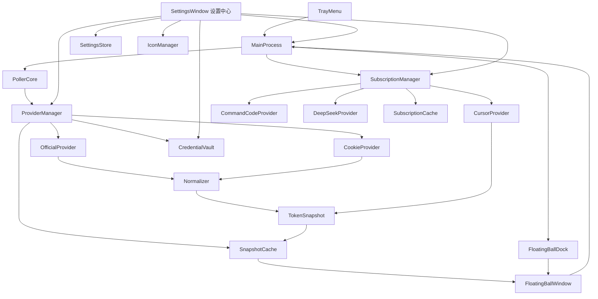

# Cursor Token Monitor — 项目参考文档

> Windows 桌面悬浮球，定期显示 Cursor 账号 **Cursor Models / Other Models** 用量与余量；设置窗口为侧边导航 + 分区面板的设置中心，按「账户与订阅 / 数据刷新 / 外观 / 关于」组织，支持 Aurora 玻璃与清爽纸面双主题。
> 本文档整合需求说明、架构设计、实现细节、使用与维护指南，便于后续查阅。

---

## 目录

1. [项目概述](#1-项目概述)
2. [快速开始](#2-快速开始)
3. [功能需求](#3-功能需求)
4. [架构设计](#4-架构设计)
5. [目录结构](#5-目录结构)
6. [数据模型与接口映射](#6-数据模型与接口映射)
7. [轮询与故障切换](#7-轮询与故障切换)
8. [安全设计](#8-安全设计)
9. [界面与交互](#9-界面与交互)
10. [配置项说明](#10-配置项说明)
11. [打包与发布](#11-打包与发布)
12. [验收清单](#12-验收清单)
13. [维护与扩展](#13-维护与扩展)
14. [风险与版本规划](#14-风险与版本规划)

---

## 1. 项目概述

| 项 | 说明 |
|---|---|
| 项目名称 | Cursor Token Monitor（Cursor Token 悬浮球） |
| 平台 | Windows |
| 技术栈 | Electron + TypeScript + React + Vite |
| 版本 | v1.0.0 |
| 目标用户 | 个人开发者（账号所有者本人） |

### 背景与目标

- **背景**：需要在桌面实时查看 Cursor 账号 token 余量，避免频繁打开网页或控制台。
- **目标**：提供轻量、常驻、可配置自动刷新的悬浮球，展示 Cursor Models 与 Other Models 用量概览、周期明细及余量；并在设置窗口内集中提供订阅额度查询（Cursor / Command Code / DeepSeek）。
- **数据策略**：官方接口优先（`OfficialProvider`），连续失败后自动回退到 Dashboard Cookie 接口（`CookieProvider`）。Cookie 方案优先读取 `usage-summary` 汇总数据；`get-aggregated-usage-events` 用于 Included Usage 周期模型明细；`get-filtered-usage-events` 作为今日/周期 token 与回退补充，避免明细接口不稳定时影响主数据展示。订阅数据独立于该链路，由 `SubscriptionManager` 按提供方各自查询（见第 4 章）。

### 范围

**范围内：**
- Windows 悬浮球（拖拽、置顶、贴边半隐收起、托盘）
- Cursor Models / Other Models 余量与 Dashboard 用量指标展示（概览 / 用量切换）
- 设置窗口侧边导航设置中心：账户与订阅 / 数据刷新 / 外观（界面风格 · 悬浮球 · 应用图标）/ 关于
- 双主题界面风格：Aurora 玻璃（深色）/ 清爽纸面（浅色），设置页切换即时生效于悬浮球与设置窗口
- 订阅额度与用量查询：Cursor 周期用量（含订阅套餐）、Command Code 额度与 5 小时/每周/每月限额（含套餐）、DeepSeek 余额与按月模型用量
- Grok Bot 用量可选计入：默认从今日%、模型明细剔除 `grok-bot-*` 模型，可在用量统计卡片开关；周期官方占比不变
- 系统托盘悬停展示概览用量摘要；右键提供设置 / 复位 / 退出
- 自动刷新与间隔配置（订阅自动刷新共用同一份配置）
- 双 Provider 故障切换（Official ⇄ Cookie）
- Dashboard API 多端点候选与局部降级
- 凭据手动配置与连通性测试（Cursor Cookie、各订阅平台 API Key / 用量 Token）
- 订阅结果与快照本地缓存（打开即有数据，查询失败保留上次成功结果）
- 自定义应用图标（托盘/设置窗即时生效）

**范围外：**
- 跨平台（macOS / Linux）
- 多账号切换（首版单账号）
- 服务端中转
- 历史趋势图表（首版不做）

### 术语

| 术语 | 含义 |
|---|---|
| auto | Cursor Models 池（原 First-party models / Auto + Composer，含 Auto、Composer、Grok 等自有模型） |
| api | Other Models 池（原 API，非 Cursor 自有模型调用相关 token） |
| Provider | 数据获取单元（Official / Cookie） |
| TokenSnapshot | 统一后的展示数据结构 |

---

## 2. 快速开始

### 环境要求

- Node.js >= 16（推荐 18+）
- Windows 10/11

### 安装与运行

```bash
# 安装依赖
npm install

# 开发模式（热更新 + Electron；dev server 固定 http://localhost:5180，端口被占用会直接报错退出）
npm run dev

# 生产构建（Vite 编译渲染层与 Electron 主/预加载进程）
npm run build
npm start

# 类型检查（tsc --noEmit，不生成 dist-electron 冗余产物）
npm run typecheck

# 打包安装程序（typecheck + build + electron-builder）
npm run dist
```

### 首次使用

1. 启动应用，屏幕右下角出现悬浮球
2. 右键系统托盘 → **应用设置**
3. 在浏览器 DevTools 中复制 `WorkosCursorSessionToken` 的值，或复制包含该字段的完整 `cursor.com` Cookie，粘贴并保存
4. 点击 **测试连接** 验证
5. 悬浮球按设定间隔自动刷新，展示 Cursor Models / Other Models 余量及数据来源

### 获取 Cookie 方法

1. 浏览器登录 [cursor.com](https://www.cursor.com)
2. 打开开发者工具（F12）→ Network
3. 刷新页面，任选 cursor.com 请求
4. 优先复制 `WorkosCursorSessionToken` 的值；也可以复制 Request Headers 中的 `Cookie` 完整值
5. 粘贴到设置页并保存（存储在 Windows 凭据库，非明文文件）

---

## 3. 功能需求

### FR-01 悬浮球显示

- 启动后显示悬浮球，支持拖拽与置顶
- 折叠态：总余量百分比（「余量」）+ 健康状态点 + 圆环进度
- 展开态：默认「概览」视图；有 Included Usage 数据时可切换至「用量」视图
- 贴边收起：AssistiveTouch 风格半隐圆球（闲置约半隐 + 半透明；悬停滑入变实）

### FR-02 明细展示

**概览视图：**

- 顶部 dashboard：总消耗百分比、进度条、周期 token 汇总、状态 pill、来源、上次刷新时间
- 四张 metric 卡片纵向排列：今日 Cursor Models、今日 Other Models、周期 Cursor Models、周期 Other Models（百分比 + token 明细）；卡片采用无左色带的玻璃层级样式，今日与周期通过明暗背景和组间分隔线区分
- 退避 / 暂停 / 无数据等状态提示

**用量视图（有 Included Usage 数据时可用）：**

- 按模型聚合的 Included Usage 列表（Cursor Models / Other Models 分区，账单周期、tokens、占比）；模型明细卡片采用统一玻璃描边样式，不使用左侧色带
- 列表区域独立滚动，概览视图无纵向滚动条

**通用：**

- `auto.remaining` / `auto.limit`、`api.remaining` / `api.limit`（接口提供时用于余量计算）
- 数据来源（official / cookie）
- stale 时状态 pill 显示「缓存数据」（不另设整页缓存提示条）

### FR-03 自动刷新与间隔配置

- 默认开启，默认间隔 **30 秒**
- 可配置范围：**30 – 3600 秒**
- 非法输入拦截并提示，修改后立即生效并持久化；历史配置若低于 30 秒，启动时自动钳制
- 支持暂停 / 恢复；暂停期间可手动刷新
- 刷新中：悬浮球与概览面板有加载反馈（旋转刷新按钮、双电流边框等）

### FR-04 数据源策略与容错

- 优先 `OfficialProvider`
- 连续失败 **3 次**（可配置）后切换 `CookieProvider`
- 回退后每 **120 秒** 探测官方接口是否恢复，恢复则自动切回
- UI 显示当前来源标签

### FR-05 Cookie 配置与测试

- 手动粘贴 Cookie
- 测试连接：成功 / 失败 + 原因；成功时展示结构化详情（耗时、数据源、总消耗、账单周期、Token 配额、用量分项、Included Usage 状态等）
- 一键清除凭据

### FR-06 托盘与生命周期

- 托盘右键菜单：**设置**、**复位**、**退出**（左键点击弹出同一菜单）。设置会打开设置窗口；复位把悬浮球恢复到主屏右下角默认位置并恢复可见
- 不再提供立即刷新 / 暂停恢复菜单项——这些能力位于悬浮球面板内
- 悬停托盘图标：多行概览用量摘要（总消耗、今日/周期 Cursor Models 与 Other Models 分项；模型名按较长标签补齐对齐，末行合并「来源 + 更新时间」），随快照刷新更新，无快照时显示「暂无数据」
- 托盘图标：自定义图标优先（`userData/custom-icon.png`，居中裁剪为正方形后按 64×64 加载以覆盖各 DPI），否则使用 `build/icon.png` 默认图标
- 关闭悬浮窗后驻留托盘，不强制退出

### FR-07 贴边缘自动收起

- 拖拽悬浮球贴近屏幕边缘松手后自动收起为半隐圆球（四边对称）
- 悬停滑入变实；点击展开或向外拖出可恢复完整显示
- 设置项 `edgeAutoDockEnabled`（默认开启）可开关

### FR-08 自定义应用图标

- 设置页可选择本地图片作为应用图标
- 托盘与设置窗口即时生效
- 支持恢复默认图标；安装包/任务栏图标需重新打包后更新

### FR-09 快照本地缓存

- 成功刷新后将 `TokenSnapshot` 持久化到 `%APPDATA%/cursor-token-monitor/snapshot-cache.json`
- 启动时或请求失败时展示缓存数据，标记 `stale = true` 并提示用户

### FR-10 订阅额度与用量查询

- 位于设置窗口「账户与订阅」区，以账户卡片纵向列表展示，默认全部收起只看一行摘要，点击头部展开明细、刷新与凭据配置
- 收起态摘要：状态点 + 平台名 + 关键数值 + 精简状态（正常 / 未配置 / 异常）；Cursor 显示订阅套餐 pill（如 Pro，来自 `usage-summary` 的 `membershipType`），Command Code 显示套餐 pill（如 Go）与 5 小时 / 每周限额小条
- 三个提供方数据形态不同：
  - **Cursor**：周期用量看板，复用主链路的 `TokenSnapshot`（本身不发独立请求）；展开态「周期与账户」首行展示订阅套餐
  - **Command Code**：额度看板——剩余额度（月度 / 购买 / 赠送）、当期消耗 / 请求数 / Tokens、套餐与续期日期，以及 5 小时 / 每周 / 每月三段限额计量条
  - **DeepSeek**：各币种余额，且支持按月查询模型用量明细（当前仅 DeepSeek 提供「用量」）
- 凭据区按卡片独立折叠：Cursor 用 `WorkosCursorSessionToken`（Cookie，支持测试连接并展示结构化结果）；其余用 API Key；支持按月用量的提供方另有独立的「用量 Token」
- 刷新策略：账户区工具栏「刷新全部」刷新所有已配置提供方；单卡片可独立刷新；自动刷新读取运行行为区的 `autoRefreshEnabled` / `refreshIntervalSec`
- 结果落盘到 `userData/subscription-cache.json`（含版本号，12 小时有效期）：打开即有数据；查询失败保留上次成功结果并给出黄色提示，不破坏缓存
- 提示分级：未配置 / 无记录为蓝色 info，最近一次查询失败为黄色 warn，查询报错为红色 error

### FR-11 设置窗口结构

- 设置窗口 840×700（最小 720×560），侧边导航 + 分区面板：**账户与订阅 / 数据刷新 / 外观 / 关于** 四分区，无 Tab 切换；窗口标题为「设置」，底色跟随界面风格避免深浅闪变
- 「账户与订阅」区：账户卡片纵向单列，工具栏含查询时间、自动刷新状态与「刷新全部」
- 「数据刷新」区：自动刷新、刷新间隔（30–3600 秒，防抖自动保存）、计入 Grok Bot 用量（默认关闭）
- 「外观」区：界面风格切换（Aurora 玻璃 / 清爽纸面）、悬浮球贴边自动收起、应用图标选择 / 恢复默认（即时生效于托盘与设置窗口）
- 「关于」区：功能范围卡片纵向铺满面板区，内容由 `README.md` 构建期 `?raw` 派生
- 面板区内容超出时纵向滚动；横向一律裁剪（装饰性光斑溢出不产生横滚条）

### 非功能需求

| 类别 | 要求 |
|---|---|
| 性能 | 冷启动 5 秒内显示悬浮球；单次请求超时默认 10 秒 |
| 稳定性 | 接口失败不崩溃；指数退避重试 |
| 安全 | Cookie 不明文存储；日志脱敏 |
| 可维护性 | Provider 与 UI 解耦；关键行为可追踪日志 |

---

## 4. 架构设计


```mermaid
flowchart TD
    trayMenu[TrayMenu] --> mainProcess[MainProcess]
    floatingBall[FloatingBallWindow] --> mainProcess
    settingsWindow[SettingsWindow 设置中心] --> mainProcess
    mainProcess --> pollerCore[PollerCore]
    pollerCore --> providerManager[ProviderManager]
    providerManager --> officialProvider[OfficialProvider]
    providerManager --> cookieProvider[CookieProvider]
    providerManager --> snapshotCache[SnapshotCache]
    officialProvider --> normalizer[Normalizer]
    cookieProvider --> normalizer
    normalizer --> tokenSnapshot[TokenSnapshot]
    tokenSnapshot --> snapshotCache
    snapshotCache --> floatingBall
    mainProcess --> subscriptionManager[SubscriptionManager]
    subscriptionManager --> cursorProvider[CursorProvider]
    subscriptionManager --> commandCodeProvider[CommandCodeProvider]
    subscriptionManager --> deepSeekProvider[DeepSeekProvider]
    subscriptionManager --> subscriptionCache[SubscriptionCache]
    cursorProvider --> tokenSnapshot
    providerManager --> credentialVault[CredentialVault]
    settingsWindow --> credentialVault
    settingsWindow --> settingsStore[SettingsStore]
    settingsWindow --> iconManager[IconManager]
    settingsWindow --> providerManager
    settingsWindow --> subscriptionManager
    mainProcess --> floatingBallDock[FloatingBallDock]
    floatingBallDock --> floatingBall
```

### 模块职责

| 模块 | 文件 | 职责 |
|---|---|---|
| 主进程 | `electron/main.ts` | 生命周期、IPC、协调各模块 |
| 边缘吸附 | `electron/floatingBallDock.ts` | 贴边半隐、悬停滑入、窗口 undock |
| 图标管理 | `electron/iconManager.ts` | 自定义图标读写与预览 |
| 悬浮窗 | `electron/windows/floatingBall.ts` | 无边框置顶窗口 |
| 设置窗 | `electron/windows/settings.ts` | 设置窗口（侧边导航设置中心，840×700，底色跟随界面风格） |
| 托盘 | `electron/tray.ts` | 系统托盘菜单与悬停 tooltip |
| 预加载 | `electron/preload.ts` | 安全 IPC 桥接 |
| 开发态 URL | `src/shared/devServer.ts` | dev server 端口与 URL 的单一来源（5180） |
| 轮询器 | `src/core/poller.ts` | 定时刷新、退避、状态机 |
| 快照缓存 | `src/core/SnapshotCache.ts` | 本地快照持久化与加载 |
| Provider 管理 | `src/core/providers/ProviderManager.ts` | 优先级切换、故障转移 |
| 官方数据源 | `src/core/providers/OfficialProvider.ts` | 无 Cookie 请求 |
| Cookie 数据源 | `src/core/providers/CookieProvider.ts` | 带 Cookie 请求 |
| 标准化 | `src/core/normalizer.ts` | 统一字段映射（含 `membershipType` 提取） |
| 订阅管理 | `src/core/subscriptions/SubscriptionManager.ts` | 订阅提供方注册、分发查询与凭据管理 |
| 订阅缓存 | `src/core/subscriptions/SubscriptionCache.ts` | 订阅结果落盘（版本号 + 12h 有效期 + 失败保留） |
| Cursor 订阅源 | `src/core/subscriptions/CursorProvider.ts` | 复用主链路快照构建周期用量（含订阅套餐） |
| Command Code 订阅源 | `src/core/subscriptions/CommandCodeProvider.ts` | alpha 接口额度 / 套餐 / 三段限额 |
| DeepSeek 订阅源 | `src/core/subscriptions/DeepSeekProvider.ts` | 余额 + 按月模型用量 |
| 设置存储 | `src/settings/SettingsStore.ts` | JSON 持久化 |
| 凭据库 | `src/security/CredentialVault.ts` | keytar / safeStorage |
| 日志 | `src/utils/logger.ts` | 敏感信息脱敏 |
| 格式化 | `src/shared/format.ts` | 展示格式化、托盘 tooltip、概览/用量构建 |
| 悬浮球 UI | `src/renderer/App.tsx` | 折叠/展开、概览/用量切换 |
| 设置 UI | `src/renderer/pages/SettingsPage.tsx` | 侧边导航设置中心骨架（账户与订阅 / 数据刷新 / 外观 / 关于） |
| 设置导航 | `src/renderer/components/SettingsNav.tsx` | 侧边导航（两字标签 + 底部品牌角标含版本号） |
| 设置面板 | `src/renderer/components/SettingsPanel.tsx` | 分区面板骨架（标题 / 描述 / fill 铺满模式） |
| 主题风格 | `src/renderer/uiStyle.ts` | 界面风格元数据与 `data-ui-style` 应用 / 跟随同步 |
| 偏好设置 UI | `src/renderer/components/SettingsTabContent.tsx` | 数据刷新 / 界面风格 / 悬浮球行为 / 应用图标 / 关于说明 |
| 核心功能卡 | `src/renderer/components/ProjectFeaturesCard.tsx` | 由 `README.md` 派生功能清单（`?raw`），默认折叠 |
| 打包编排 | `scripts/dist.mjs` | 结束残留实例、工作区外打包、发布产物到 `release/` |
| 订阅 UI | `src/renderer/pages/SubscriptionsPage.tsx` | 账户卡片列表：独立展开、独立刷新、独立凭据配置 |
| 订阅面板 | `src/renderer/components/SubscriptionPanels.tsx` | Cursor / Command Code / DeepSeek 展示面板 |
| 订阅工具 | `src/renderer/components/SubscriptionUtils.ts` | 订阅页工具函数（含套餐文案与限额摘要） |
| 提示条 | `src/renderer/components/ErrorHint.tsx` | 分级提示（info / warn / error） |
| 连接测试面板 | `src/renderer/components/TestConnectionResultPanel.tsx` | 测试连接结构化结果 |
| 指标行 | `src/renderer/components/MetricRow.tsx` | Dashboard metric 明细展示 |
| Included 列表 | `src/renderer/components/IncludedUsageTable.tsx` | Included Usage 用量明细 |

---

## 5. 目录结构

```
cursor_monitor/
├── electron/                    # Electron 主进程
│   ├── main.ts                  # 入口、IPC 注册、生命周期
│   ├── preload.ts               # 渲染进程 API 桥接
│   ├── tray.ts                  # 系统托盘菜单 / 悬停 tooltip / 图标
│   ├── floatingBallDock.ts      # 边缘吸附与半隐
│   ├── iconManager.ts           # 自定义图标管理
│   └── windows/
│       ├── floatingBall.ts      # 悬浮球窗口（固定 300 宽）
│       └── settings.ts          # 设置窗口（侧边导航设置中心）
├── src/
│   ├── core/
│   │   ├── poller.ts            # 轮询与状态机
│   │   ├── SnapshotCache.ts     # 快照本地缓存
│   │   ├── normalizer.ts        # 字段标准化
│   │   ├── snapshotMerge.ts     # 快照合并
│   │   ├── providers/
│   │   │   ├── OfficialProvider.ts
│   │   │   ├── CookieProvider.ts
│   │   │   └── ProviderManager.ts
│   │   └── subscriptions/
│   │       ├── types.ts              # SubscriptionProvider 接口
│   │       ├── SubscriptionManager.ts # 注册 / 分发 / 凭据
│   │       ├── SubscriptionCache.ts   # 落盘缓存
│   │       ├── CursorProvider.ts      # Cursor 周期用量（复用快照）
│   │       ├── CommandCodeProvider.ts # Command Code 额度看板
│   │       └── DeepSeekProvider.ts    # DeepSeek 余额 + 按月用量
│   ├── settings/
│   │   └── SettingsStore.ts     # 本地配置
│   ├── security/
│   │   └── CredentialVault.ts   # 凭据安全存储
│   ├── shared/
│   │   ├── types.ts             # 类型定义
│   │   ├── subscriptionTypes.ts # 订阅相关类型
│   │   ├── format.ts            # 展示格式化 / 托盘 tooltip
│   │   └── devServer.ts         # 开发态 dev server 端口与 URL
│   ├── utils/
│   │   └── logger.ts            # 脱敏日志
│   └── renderer/                # React 渲染层
│       ├── App.tsx              # 悬浮球
│       ├── main.tsx             # 悬浮球入口
│       ├── settings-main.tsx    # 设置窗入口
│       ├── uiStyle.ts           # 界面风格元数据与 data-ui-style 同步
│       ├── pages/
│       │   ├── SettingsPage.tsx      # 侧边导航设置中心骨架
│       │   └── SubscriptionsPage.tsx # 账户卡片列表
│       └── components/
│           ├── SettingsNav.tsx          # 设置侧边导航（含品牌角标）
│           ├── SettingsPanel.tsx        # 分区面板骨架（fill 铺满模式）
│           ├── SettingsTabContent.tsx   # 偏好设置卡片（数据刷新/风格/悬浮球/图标）+ 关于说明
│           ├── ProjectFeaturesCard.tsx  # 关于与功能说明（读 README）
│           ├── SubscriptionPanels.tsx
│           ├── SubscriptionUtils.ts
│           ├── IncludedUsageTable.tsx
│           ├── TestConnectionResultPanel.tsx
│           ├── ErrorHint.tsx
│           ├── MetricRow.tsx
│           └── TokenBadge.tsx
├── docs/
│   └── changes/                 # 代码变更归档（见 .cursor/rules/change-archive.mdc）
├── scripts/
│   ├── dist.mjs                 # 打包编排（结束残留实例 / 工作区外打包 / 发布产物）
│   ├── create-icon.ps1          # 生成 build/icon.ico
│   ├── verify-*.ts              # 主链路 / 订阅验收脚本（内存 mock）
├── .cursor/rules/               # 项目级规则（变更归档等）
├── .cursorignore                # 编辑器索引排除（构建产物）
├── .vscode/settings.json        # 编辑器 search / watcher 排除
├── index.html                   # 悬浮球入口
├── settings.html                # 设置窗口入口（侧边导航设置中心）
├── vite.config.ts
├── tsconfig.json
├── tsconfig.electron.json
├── electron-builder.yml
├── package.json
└── release/                     # 打包产物
```

---

## 6. 数据模型与接口映射

### TokenSnapshot（统一输出）

```json
{
  "source": "official",
  "auto": { "remaining": 120000, "limit": 200000, "resetAt": "2026-07-31T00:00:00Z" },
  "api": { "remaining": 80000, "limit": 100000, "resetAt": "2026-07-31T00:00:00Z" },
  "fetchedAt": "2026-07-03T04:00:00Z",
  "stale": false,
  "rawVersion": "official:v1"
}
```

| 字段 | 类型 | 说明 |
|---|---|---|
| source | `official \| cookie` | 数据来源 |
| auto / api | `{ remaining, limit, resetAt? }` | 余量信息，缺失为 null |
| metrics | `UsageMetrics` | dashboard 百分比、周期 token、今日 token/消耗等补充指标 |
| fetchedAt | ISO 8601 | 抓取时间 |
| stale | boolean | 是否过期/不完整 |
| rawVersion | string | 接口版本标识，便于排障 |

### OfficialProvider 映射

默认端点：`https://www.cursor.com/api/usage`

```json
{
  "autoRemaining": 120000,
  "autoLimit": 200000,
  "autoResetAt": "2026-07-31T00:00:00Z",
  "apiRemaining": 80000,
  "apiLimit": 100000,
  "apiResetAt": "2026-07-31T00:00:00Z"
}
```

| 原始字段 | TokenSnapshot 字段 |
|---|---|
| autoRemaining | auto.remaining |
| autoLimit | auto.limit |
| autoResetAt | auto.resetAt |
| apiRemaining | api.remaining |
| apiLimit | api.limit |
| apiResetAt | api.resetAt |

`normalizer.ts` 同时支持嵌套格式（`auto.remaining`、`usage.auto.remaining` 等）。

### CookieProvider 映射（Dashboard 替代方案）

默认候选端点（请求头带 Cookie）：

1. `https://cursor.com/api/usage-summary`
2. `https://www.cursor.com/api/usage-summary`
3. `https://cursor.com/api/dashboard/usage-summary`
4. `https://www.cursor.com/api/dashboard/usage-summary`
5. 用户配置的 `cookieEndpoint`

这些端点返回 dashboard 汇总用量，是当前更稳定的主数据来源。实现上每个候选端点独立超时，当前一个端点超时、404、5xx 或返回不可用内容时，会继续尝试下一个候选端点。

```json
{
  "billingCycleStart": "2026-07-01T00:00:00Z",
  "billingCycleEnd": "2026-07-31T00:00:00Z",
  "individualUsage": {
    "plan": {
      "limit": 20,
      "remaining": 12,
      "totalPercentUsed": 40,
      "apiPercentUsed": 10,
      "autoPercentUsed": 30
    }
  }
}
```

| 原始字段 | TokenSnapshot 字段 |
|---|---|
| individualUsage.plan.autoPercentUsed + limit | auto.remaining / auto.limit / metrics.autoUsedPercent |
| individualUsage.plan.apiPercentUsed + limit | api.remaining / api.limit / metrics.apiUsedPercent |
| individualUsage.plan.totalPercentUsed | metrics.totalUsedPercent |
| billingCycleEnd | auto.resetAt / api.resetAt |

### Usage Events 明细补充

补充端点：

1. `https://cursor.com/api/dashboard/get-aggregated-usage-events`（Billing Included Usage 同源聚合，优先）
2. `https://www.cursor.com/api/dashboard/get-aggregated-usage-events`
3. `https://cursor.com/api/dashboard/get-filtered-usage-events`（今日/周期 token 与 Included Usage 回退）
4. `https://www.cursor.com/api/dashboard/get-filtered-usage-events`

`get-aggregated-usage-events` 返回周期内按模型汇总的 tokens / cost，用于展开面板底部 **Included Usage**，与控制台 Billing 口径对齐，无需事件分页。

`get-filtered-usage-events` 用于补充周期内 token 总量和今日 token/消耗，并在聚合接口不可用时回退构建 Included Usage。该端点依赖 `WorkosCursorSessionToken` 中的 `userId`，应用会从 `userId::jwt`、URL 编码格式或 JWT `sub` 中提取。若事件接口失败、超时或无法提取 `userId`，应用仍会展示 `usage-summary` 的汇总百分比，并将 token 明细保持为 `null`。

### 异常处理规则

- 单字段缺失 → 该字段为 `null`，不影响其他字段
- 两类余量均缺失 → `stale = true`，提示「数据不完整」
- 事件明细失败 → 保留汇总数据，仅缺失 token 明细
- 汇总解析失败 → 保留最近成功快照，进入退避重试
- 日志禁止输出完整 Cookie / Authorization

---

## 7. 轮询与故障切换

### 自动刷新状态机

| 状态 | 说明 |
|---|---|
| idle | 初始 |
| running | 正常轮询 |
| backoff | 失败退避等待 |
| paused | 用户暂停 |

| 事件 | 行为 |
|---|---|
| start | → running |
| refreshSuccess | 保持 running，重置失败计数 |
| refreshFail | 失败 +1，必要时 → backoff |
| pause | → paused |
| resume | paused → running |
| manualRefresh | 任意状态触发一次，paused 不改变暂停状态 |

### 退避策略

失败时：`30s → 60s → 120s → 300s`（上限 5 分钟）  
成功后：恢复为用户设置的刷新间隔

### Provider 切换流程

```
OfficialProvider 请求
    │
    ├─ 成功 → 展示数据，source = official
    │
    └─ 连续失败 ≥ failureThreshold（默认 3 次）
           │
           ├─ Cookie 已配置 → 切换 CookieProvider
           │                    ├─ usage-summary 成功 → 展示汇总数据
           │                    ├─ usage events 成功 → 补充 token 明细
           │                    ├─ usage events 失败 → 仅展示汇总数据
           │                    └─ 每 120s 探测 Official 是否恢复
           │
           └─ Cookie 未配置 → 保留上次快照，stale = true，提示配置 Cookie
```

---

## 8. 安全设计

| 措施 | 实现 |
|---|---|
| Cookie 存储 | Windows Credential Manager（keytar），失败时 safeStorage 加密本地文件 |
| 订阅凭据存储 | API Key 与「用量 Token」同样走 `CredentialVault`，按账户名区分（如 `commandcode-api-key`、`deepseek-api-key`、`deepseek-usage-token`） |
| Command Code Key 解析 | 三级优先级：手动录入（可覆盖）→ 环境变量 `COMMAND_CODE_API_KEY` / `COMMANDCODE_API_KEY` → 只读 `~/.commandcode/auth.json`；读取失败静默跳过，不记录凭据内容 |
| 配置文件 | 仅存非敏感项（刷新间隔、端点 URL），不含 Cookie / API Key |
| 日志脱敏 | `logger.ts` 对 cookie / authorization / session 等字段打码 |
| 用户提示 | 设置窗口订阅分区说明凭据仅用于本人账号查询 |
| 清除凭据 | 一键删除，之后不再发起对应平台的请求 |

---

## 9. 界面与交互

### 悬浮球

| 状态 | 内容 |
|---|---|
| 折叠 | 圆形球体、余量百分比、圆环进度、健康点（绿/黄/蓝/灰） |
| 贴边收起 | 半隐圆球（闲置约半隐 + opacity 0.4；悬停滑入变实），点击展开或拖出恢复 |
| 展开 · 概览 | 总消耗 dashboard、4 张纵向 metric 卡片、状态/来源/时间、刷新/设置/收起；卡片采用无左色带玻璃样式并区分今日/周期；面板进出场动画 |
| 展开 · 用量 | Included Usage 分区列表（有数据时底部分段「概览 / 用量」），长模型名自动换行；模型明细卡片采用无左色带玻璃样式 |

健康点含义：
- **绿**：数据正常
- **黄**：数据过期或退避中（stale 时 pill 显示「缓存数据」）
- **蓝**：自动刷新已暂停，或正在刷新
- **灰**：暂无数据

未贴边窗口固定 **300×548**，展开/收起与概览/用量切换不再改变窗体尺寸；贴边 peek 高度为 **448**（宽度同 300）。

视觉细节：弹窗 header 左侧为「三色状态灯 + Cursor监控」品牌行——三色灯为纯装饰循环动画（红→黄→绿，2.7s 错相位），与健康状态 / 用量数据完全解耦；`prefers-reduced-motion: reduce` 下三灯静态显示熄灭态。悬浮球本体与概览/用量卡片叠加动态玻璃质感（缓慢扫过的光泽带 + 描边高光，各卡片错相位），减少动态效果时关闭扫光但保留玻璃质感。

### 设置窗口（侧边导航设置中心）

窗口 840×700（最小 720×560），侧边导航 + 分区面板：**账户与订阅 / 数据刷新 / 外观 / 关于**；窗口标题显示「设置」。导航两字标签（账户 / 数据 / 外观 / 关于），底部为品牌角标（logo + 应用名 + 版本号）。

**账户与订阅**

- 账户卡片纵向单列，默认全部收起只看一行摘要，点击头部展开明细、刷新与凭据配置
- 收起态摘要：状态点 + 平台名 + 关键数值 + 精简状态（正常 / 未配置 / 异常）；Cursor 显示订阅套餐 pill（如 Pro），Command Code 显示套餐 pill（如 Go）与 5 小时 / 每周限额小条
- 工具栏「刷新全部」刷新所有已配置提供方；meta 行显示查询时间与自动刷新状态（间隔与开关跟随运行行为区配置）
- 面板随卡片展开展示：
  - Cursor：周期用量（总用量、来源、账单周期、订阅套餐、Cursor Models / Other Models 百分比与模型明细）
  - Command Code：账户额度（剩余额度拆分、当期消耗 / 请求数 / Tokens、套餐与续期）+ 5 小时 / 每周 / 每月三段限额计量条
  - DeepSeek：各币种余额 + 按月模型用量表
- 凭据配置区按卡片独立折叠：Cursor 填 `WorkosCursorSessionToken` 并可测试连接（结构化结果）；其余平台填 API Key；支持按月用量的平台另有独立的「用量 Token」
- 打开即有缓存数据；查询失败保留上次成功结果并给出黄色提示

**数据刷新**

- 单卡三行：自动刷新、刷新间隔（30–3600 秒，防抖自动保存）、计入 Grok Bot 用量（默认关闭）

**外观**

- 三张等高卡片（统一中性染色纸风格，Aurora 下统一品牌流光）：
  - 界面风格：Aurora 玻璃（深色玻璃极光）/ 清爽纸面（浅色坐标纸底纹、静态无动效、高对比文字），Segmented 切换即时生效并同时作用于悬浮球与设置窗口；窗口底色随风格切换
  - 悬浮球行为：贴边缘自动收起
  - 应用图标：自定义应用图标（选择 / 恢复默认）

**关于**

- 功能范围与设计说明卡纵向铺满面板区（功能条目 space-evenly 均匀分布），由 `README.md` 派生（构建期 `?raw` 同步）

### 托盘

**悬停提示**（多行，模型名补齐对齐，随快照更新）：

```text
总消耗 12.34%
今日 Cursor Models 2.30%
今日 Other Models  1.20%
周期 Cursor Models 5.00%
周期 Other Models  10.00%
来源 官方  更新 14:32:05
```

**右键菜单**

- 设置（打开设置窗口）
- 复位（悬浮球回到主屏右下角默认位置并恢复可见）
- 退出

---

## 10. 配置项说明

配置文件位置：`%APPDATA%/cursor-token-monitor/settings.json`

| 配置项 | 默认值 | 说明 |
|---|---|---|
| autoRefreshEnabled | true | 是否自动刷新 |
| refreshIntervalSec | 30 | 刷新间隔（**30**–3600） |
| requestTimeoutSec | 10 | 单次请求超时 |
| officialEndpoint | `https://www.cursor.com/api/usage` | 官方接口 |
| cookieEndpoint | `https://cursor.com/api/usage-summary` | 用户自定义 Cookie 汇总接口候选 |
| failureThreshold | 3 | 切换 Provider 的失败次数阈值 |
| edgeAutoDockEnabled | true | 贴边缘自动收起 |
| includeGrokBotUsage | false | 是否将 Grok Bot 计入今日% 与模型明细 |
| customIconPath | null | 自定义图标路径（null 为默认） |
| uiStyle | aurora | 界面风格：aurora（深色玻璃极光）/ calm（浅色清爽纸面），同时作用于悬浮球与设置窗口，设置页「外观」分区可切换 |

修改端点或映射逻辑见 [维护与扩展](#13-维护与扩展)。

---

## 11. 打包与发布

### 前置步骤：生成图标

项目使用 `build/icon.png` 作为图标源文件。打包前必须将其转换为多尺寸 `.ico` 文件（NSIS 安装包需要）：

```powershell
powershell -ExecutionPolicy Bypass -File scripts\create-icon.ps1
```

脚本会从 `build/icon.png` 居中裁剪为正方形，生成 16/32/48/256 四种尺寸的 `build/icon.ico`。

> **注意**：每次更换 `build/icon.png` 后都需要重新执行此脚本，否则 NSIS 构建会因无法读取图标而失败。

### 执行打包

```bash
npm run dist
```

等价于 `npm run typecheck && npm run build && node scripts/dist.mjs`：

1. **typecheck** — `tsc --noEmit` 类型检查，不生成冗余 JS
2. **build** — Vite 编译 `dist/`（渲染层）与 `dist-electron/main.js`、`preload.js`（主/预加载进程）；`keytar` 作为原生模块保持 external，由 electron-builder 随生产依赖一并打包
3. **dist.mjs** — 先结束残留的应用实例，再由 `electron-builder` 打包 NSIS 安装包与 portable 便携版，最后把产物发布到 `release/`

产物位于 `release/`：

| 文件 | 说明 |
|---|---|
| `Cursor Token Monitor Setup 1.0.0.exe` | NSIS 安装包 |
| `Cursor Token Monitor 1.0.0.exe` | 便携版 |
| `win-unpacked/` | 免安装目录 |

> 当前环境打包时禁用了代码签名（`signAndEditExecutable: false`）。正式发布建议配置证书签名。

#### 为什么要在工作区之外打包

`electron-builder` 每次打包前会清空输出目录。产物中的 `app.asar` 是 Electron 归档，
**任何打开本项目的 Electron 系编辑器/IDE**（VS Code、Cursor、MiniMax Code、OpenChamber 等）
在索引工作区时都会打开并一直占用它，导致删除失败并报错：

```
remove ...\release-build\win-unpacked\resources\app.asar: The process cannot access the file because it is being used by another process.
ERR_ELECTRON_BUILDER_CANNOT_EXECUTE
```

该文件被占用时既不能删除也不能重命名，重试也无法解决。因此 `scripts/dist.mjs` 改为：

1. 先结束残留的已打包应用 / dev Electron 实例；
2. 在工作区**之外**（默认 `%LOCALAPPDATA%\CursorTokenMonitor\dist`，可用环境变量
   `CURSOR_MONITOR_DIST_DIR` 覆盖）完成打包，IDE 不会索引到该目录，也就无从加锁；
3. 仅把安装包、`latest.yml` 等发布物拷回 `release/`，并在未被占用时刷新 `release/win-unpacked`。

仓库同时提供 `.cursorignore` 与 `.vscode/settings.json`（`search.exclude` /
`files.watcherExclude`），用于阻止编辑器索引构建产物，从源头避免该问题。

### 体积优化策略

| 优化项 | 配置 | 效果 |
|---|---|---|
| 收窄打包输入 | `files` 仅含 `dist-electron/main.js`、`preload.js`，排除 `*.map` | 避免 tsc 重复产物进入 asar |
| 依赖归类 | `react`/`react-dom` 置于 devDependencies | 避免重复打入 asar |
| Locale 裁剪 | `electronLanguages: [en-US, zh-CN]` | locales 从 ~36 MB 降至 ~1 MB |
| 压缩级别 | `compression: maximum` | NSIS 安装包进一步压缩 |

当前典型体积（x64）：便携版 ~67 MB，安装包 ~67 MB（较初始 ~74 MB 减少约 7 MB）。

### 打包前注意事项

**残留的应用实例会被自动结束**：`scripts/dist.mjs` 会在打包前关闭已打包应用与 dev Electron 实例，无需手动处理。

若 `release/win-unpacked` 提示被占用而未能刷新，说明某个打开本项目的编辑器/IDE 仍在索引它——
关闭该编辑器（或重新加载使其读取新的排除配置）后再执行一次 `npm run dist` 即可；安装包本身不受影响。
也可临时使用便携版 `release/Cursor Token Monitor 1.0.0.exe` 验证。

---

## 12. 验收清单

- [ ] 启动后 5 秒内出现悬浮球，可拖拽、置顶、贴边半隐收起
- [ ] 折叠态显示余量百分比；展开概览可见总消耗与 4 张纵向 metric 卡片
- [ ] 有 Included Usage 时可在概览/用量间切换，概览无纵向滚动
- [ ] 稳定展示 Cursor Models / Other Models 数值与 Dashboard 指标，标注数据来源
- [ ] 自动刷新默认开启，间隔可改（30–3600 秒）且立即生效
- [ ] 非法间隔输入被拦截，轮询不崩溃
- [ ] 官方接口失败后自动回退 Cookie，界面有提示
- [ ] 清除凭据后停止敏感请求，UI 给出引导
- [ ] 快照缓存在启动/失败时可展示 stale 数据（状态 pill 标识）
- [ ] 托盘悬停显示多行概览用量（模型名列对齐），随刷新更新
- [ ] 托盘右键含设置、复位、退出；左键点击弹出同一菜单
- [ ] 设置窗口侧边导航四分区（账户与订阅 / 数据刷新 / 外观 / 关于），无 Tab
- [ ] 调试折叠可展示数据库路径与命中表，并可复制诊断信息
- [ ] 订阅三张账户卡片默认收起，未配置时给出引导并显示未配置状态
- [ ] 订阅「刷新全部」覆盖全部已配置提供方；打开设置窗口立即显示缓存
- [ ] Command Code 收起态展示套餐与 5 小时/每周限额，展开可见额度与三段限额；DeepSeek 可按月查询模型用量
- [ ] Cursor 收起态展示订阅套餐（如 Pro），展开明细「周期与账户」首行展示订阅套餐
- [ ] 订阅查询失败时保留上次成功结果并给出黄色提示，不显示空白
- [ ] 数据刷新分区改刷新间隔后，订阅自动刷新同步生效
- [ ] 外观分区三卡等高、全部分区卡片风格统一（Aurora 品牌流光 / 纸面中性染色）；关于页功能卡铺满面板区且内容与 README「范围内」清单一致
- [ ] 「外观」分区切换界面风格后，悬浮球与设置窗口立即换肤且窗口底色无深浅闪变
- [ ] 「计入 Grok Bot 用量」开关切换后用量立即按新口径刷新
- [ ] 自定义图标可即时生效于托盘与设置窗
- [ ] 安装包可在 Windows 环境安装运行

---

## 13. 维护与扩展

### 接口变更时改哪里

**主链路（Cursor 用量）**——接口字段或路径变化时通常只需改以下文件，**无需动 UI**：

1. **`src/core/providers/OfficialProvider.ts`** — 官方请求 URL、Header
2. **`src/core/providers/CookieProvider.ts`** — Cookie 请求 URL、Header
3. **`src/core/normalizer.ts`** — 字段映射规则
4. **`src/shared/types.ts`** — 如有新原始响应结构，补充类型

**订阅平台**——改动同样收敛在对应 Provider 与其展示面板：

1. **`src/core/subscriptions/CommandCodeProvider.ts`** — alpha 接口（whoami / billing / usage summary）与字段解析
2. **`src/core/subscriptions/DeepSeekProvider.ts`** — 余额与按月用量接口
3. **`src/core/subscriptions/CursorProvider.ts`** — Cursor 看板字段映射（数据来自主链路快照）
4. **`src/core/subscriptions/SubscriptionCache.ts`** — 结果结构变化时同步提升 `CACHE_VERSION`（版本不符会丢弃旧缓存）
5. **`src/renderer/components/SubscriptionPanels.tsx`** — 展示字段与排版

### 新增 Provider

**主链路（TokenProvider）**

1. 在 `src/core/providers/` 新建 Provider 类，实现 `TokenProvider` 接口
2. 在 `ProviderManager.ts` 注册优先级与切换逻辑
3. 在 `normalizer.ts` 添加对应 normalize 函数

**订阅提供方（SubscriptionProvider）**

1. 在 `src/core/subscriptions/` 新建类，实现 `SubscriptionProvider` 接口（`id` / `label` / 凭据账号 / `isConfigured` / `fetchInfo`，可选 `fetchUsage`——实现它即表示支持按月用量）
2. 在 `SubscriptionManager` 构造函数中注册，**注册顺序即账户卡片展示顺序**
3. 在 `SubscriptionPanels.tsx` 补对应展示面板，并在 `SubscriptionsPage.tsx` 的分发处接入

### IPC 接口一览

| 通道 | 方向 | 说明 |
|---|---|---|
| get-snapshot | invoke | 获取当前 TokenSnapshot |
| get-poller-state | invoke | 获取轮询状态 |
| get-settings / update-settings | invoke | 读取 / 更新配置（含刷新间隔校验，变更后广播 `settings-changed`） |
| save-cookie / clear-cookie / has-cookie | invoke | Cookie 保存 / 清除 / 状态查询 |
| test-connection | invoke | 测试 Cookie 连接（结构化结果） |
| manual-refresh / toggle-pause | invoke | 手动刷新 / 暂停恢复 |
| subscription-list-providers | invoke | 订阅提供方元数据列表（顺序即账户卡片顺序） |
| subscription-get-cached | invoke | 读取订阅缓存快照 |
| subscription-save-key / subscription-clear-key | invoke | 保存 / 清除订阅凭据 |
| subscription-fetch-info | invoke | 拉取指定提供方账户与额度信息 |
| subscription-fetch-usage | invoke | 拉取指定提供方按月用量（校验月份 / 年份） |
| set-orb-mode-async | invoke | 设置悬浮球模式（异步版） |
| get-cursor-in-window | invoke | 光标是否在窗口内及相对坐标 |
| get-icon-preview / select-custom-icon / clear-custom-icon | invoke | 图标预览 / 选择 / 恢复默认 |
| snapshot-updated | event | 快照更新推送（仅悬浮球） |
| poller-state | event | 轮询状态推送（仅悬浮球） |
| dock-state-changed | event | 贴边状态变更（edge 或 null，仅悬浮球） |
| settings-changed | event | 配置变更推送（广播到所有窗口） |
| open-settings | send | 打开设置窗口 |
| set-orb-mode | send | 设置悬浮球窗口模式（collapsed / hover / expanded） |
| set-expanded | send | 空实现，仅保留向后兼容 |
| set-expanded-panel-layout | send | 切换展开面板布局（概览 / 用量） |
| set-ignore-mouse-events | send | 设置鼠标穿透（贴边半隐时使用） |
| move-window / finish-window-move / undock-window | send | 拖动窗口 / 拖动结束（触发贴边检测）/ 取消贴边 |

### 常见问题

| 问题 | 排查 |
|---|---|
| 悬浮球无数据 | 检查 Cookie 是否过期；到设置窗口账户卡片测试连接 |
| 一直显示 cookie 来源 | 官方接口不可用，属正常回退；确认端点 URL |
| 数据不完整 | `usage-summary` 字段变化，更新 normalizer 映射 |
| 有百分比但无 token 明细 | `get-filtered-usage-events` 失败或 Cookie 中无法解析 userId；主汇总数据不受影响 |
| 订阅一直显示缓存时间 | 点「刷新全部」或单卡片「刷新」重新查询；查询失败会保留上次成功结果并给出黄色提示 |
| Command Code 报「API Key 无效或已过期」 | 检查手动录入的 Key；清除手动 Key 后会回退到环境变量 / `~/.commandcode/auth.json` |
| DeepSeek 有余额但没有月度用量 | 需要单独配置「用量 Token」（与 API Key 不同） |
| 订阅页自动刷新不生效 | 检查运行行为区的自动刷新开关与刷新间隔 |
| dev server 报端口 5180 被占用 | `strictPort` 下会直接报错退出；释放端口或调整 `src/shared/devServer.ts` 的 `DEV_SERVER_PORT` |
| keytar 安装失败 | 使用 safeStorage 回退；或安装 Windows Build Tools |
| 打包时报 `Access is denied` | 已打包的应用正在运行，关闭后重试（托盘 → 退出，或用 `Stop-Process` 强制关闭） |
| 打包时报 `unable to read icon from file` | `build/icon.ico` 无效或缺失，执行 `scripts/create-icon.ps1` 重新生成 |

---

## 14. 风险与版本规划

### 风险

- 官方 `/api/usage` 不可用或频繁变更 → OfficialProvider 不稳定
- Dashboard 事件明细接口可能限流或字段变化 → token 明细缺失，但汇总百分比仍可展示
- Cookie 获取方式可能随平台策略调整
- 接口无公开文档，字段映射需持续维护
- Command Code alpha 接口为内部接口（与 `cmd` CLI 的 `/usage` 同源），无公开承诺，路径或响应结构可能变动
- DeepSeek 的按月用量接口依赖浏览器侧凭据与 UA，平台策略调整会导致用量不可用（余额不受影响）
- 打包默认图标存在文件名隐患：`iconManager` 读取 `build/icon.png`，而 electron-builder 的 `files` 仅收录 `build/icon.ico`

### 假设

- 用户可合法获取并维护本人 Cookie / API Key
- 首版不做历史统计图表

### 版本规划

| 版本 | 内容 |
|---|---|
| **v1（当前）** | 单账号、自动刷新、双 Provider 回退、Dashboard 概览/用量、侧边导航设置中心（账户与订阅 / 数据刷新 / 外观 / 关于）、订阅额度与按月用量（Cursor / Command Code / DeepSeek，含套餐展示）、双主题界面风格（Aurora 玻璃 / 清爽纸面）、贴边半隐、托盘悬停用量、自定义图标、快照与订阅缓存、连接测试详情 |
| v1.1 | 开机自启、主题适配、简易历史趋势 |
| v1.2 | 多账号、告警阈值通知 |

---

*文档版本：v1.7 | 最后更新：2026-10-02*
